# Diagramme de Classe - Système BNRM

Ce fichier contient le diagramme de classe complet du portail BNRM avec toutes les plateformes et services.

## Comment utiliser ce fichier

1. **Modifier localement** : Éditez ce fichier directement dans votre éditeur de code
2. **Visualiser** : Utilisez [Mermaid Live Editor](https://mermaid.live/) pour prévisualiser et exporter
3. **Exporter** : Sur Mermaid Live Editor, vous pouvez exporter en PNG, SVG ou PDF

## Diagramme de Classe

```mermaid
classDiagram
    %% ==========================================
    %% GESTION DES UTILISATEURS ET AUTHENTIFICATION
    %% ==========================================
    class User {
        +UUID id
        +String email
        +DateTime created_at
    }
    
    class Profile {
        +UUID id
        +UUID user_id
        +String first_name
        +String last_name
        +String phone
        +String institution
        +String research_field
        +String partner_organization
        +Boolean is_approved
        +DateTime created_at
    }
    
    class UserRole {
        +UUID id
        +UUID user_id
        +Enum role
        +UUID granted_by
        +DateTime expires_at
        +DateTime created_at
    }
    
    class Permission {
        +UUID id
        +String name
        +String category
        +String description
    }
    
    class RolePermission {
        +UUID id
        +UUID permission_id
        +Enum role
        +Boolean granted
    }
    
    class UserPermission {
        +UUID id
        +UUID user_id
        +UUID permission_id
        +Boolean granted
        +DateTime expires_at
    }
    
    %% ==========================================
    %% BIBLIOTHÈQUE NUMÉRIQUE
    %% ==========================================
    class Content {
        +UUID id
        +String title
        +String slug
        +Text content_body
        +Enum content_type
        +Enum status
        +UUID author_id
        +DateTime published_at
        +Integer view_count
        +Boolean is_featured
        +String file_url
        +Boolean download_enabled
        +DateTime created_at
    }
    
    class ContentCategory {
        +UUID id
        +String name
        +String slug
        +Enum content_type
        +String description
        +String color
    }
    
    class ContentCategoryRelation {
        +UUID id
        +UUID content_id
        +UUID category_id
    }
    
    class ContentTranslation {
        +UUID id
        +UUID content_id
        +String language_code
        +String title
        +Text content_body
        +Boolean is_approved
        +UUID translated_by
    }
    
    class Collection {
        +UUID id
        +String name
        +String description
        +UUID curator_id
        +DateTime created_at
    }
    
    class VirtualExhibition {
        +UUID id
        +String title
        +Text description
        +DateTime start_date
        +DateTime end_date
        +Boolean is_active
        +Integer visitor_count
        +UUID curator_id
    }
    
    class ExhibitionResource {
        +UUID id
        +UUID exhibition_id
        +UUID content_id
        +Integer display_order
    }
    
    %% ==========================================
    %% PLATEFORME MANUSCRITS
    %% ==========================================
    class Manuscript {
        +UUID id
        +String title
        +String author
        +String cote
        +String inventory_number
        +String language
        +String period
        +String material
        +String institution
        +Enum access_level
        +Text description
        +String permalink
        +Text ocr_text
        +DateTime created_at
    }
    
    class ManuscriptPage {
        +UUID id
        +UUID manuscript_id
        +Integer page_number
        +String image_url
        +Text ocr_text
        +JSONB paragraphs
        +DateTime created_at
    }
    
    class PartnerCollection {
        +UUID id
        +UUID partner_id
        +String name
        +String institution
        +Text description
        +Enum approval_status
        +UUID approved_by
        +DateTime created_at
    }
    
    class ManuscriptPlatformUser {
        +UUID id
        +UUID user_id
        +Enum role
        +Boolean is_active
        +UUID approved_by
        +DateTime created_at
    }
    
    class AccessRequest {
        +UUID id
        +UUID user_id
        +UUID manuscript_id
        +String request_type
        +Text purpose
        +String status
        +UUID approved_by
        +Date requested_date
        +DateTime created_at
    }
    
    %% ==========================================
    %% PORTAIL KITAB (DÉPÔT LÉGAL / ISBN-ISSN)
    %% ==========================================
    class LegalDepositRequest {
        +UUID id
        +String request_number
        +UUID initiator_id
        +UUID collaborator_id
        +Enum support_type
        +Enum monograph_type
        +String title
        +String author_name
        +String isbn
        +String issn
        +String ismn
        +Enum status
        +String dl_number
        +String isbn_assigned
        +JSONB metadata
        +DateTime created_at
    }
    
    class DepositWorkflowStep {
        +UUID id
        +UUID request_id
        +Integer step_number
        +String step_name
        +String status
        +UUID gestionnaire_id
        +Text comments
        +DateTime processed_at
    }
    
    class Professional {
        +UUID id
        +UUID user_id
        +String company_name
        +String ice_number
        +Enum profession_type
        +String address
        +Boolean is_verified
        +DateTime created_at
    }
    
    %% ==========================================
    %% SERVICES BNRM
    %% ==========================================
    class BNRMService {
        +String id_service
        +String nom_service
        +String categorie
        +Text description
        +String public_cible
        +String reference_legale
    }
    
    class BNRMTariff {
        +String id_tarif
        +String id_service
        +Decimal montant
        +String devise
        +String periode_validite
        +String condition_tarif
        +Boolean is_active
    }
    
    class BNRMTariffHistory {
        +UUID id
        +String id_tarif
        +Decimal ancienne_valeur
        +Decimal nouvelle_valeur
        +String action
        +UUID utilisateur_responsable
        +DateTime date_modification
    }
    
    class BNRMWallet {
        +UUID id
        +UUID user_id
        +Decimal balance
        +String currency
        +Boolean is_active
        +DateTime created_at
    }
    
    class WalletTransaction {
        +UUID id
        +UUID wallet_id
        +Decimal amount
        +String transaction_type
        +UUID reference_id
        +Decimal balance_before
        +Decimal balance_after
        +DateTime created_at
    }
    
    class PaymentTransaction {
        +UUID id
        +String transaction_number
        +UUID user_id
        +Decimal amount
        +String currency
        +String payment_method
        +String status
        +UUID service_registration_id
        +JSONB metadata
        +DateTime created_at
    }
    
    class ServiceRegistration {
        +UUID id
        +UUID user_id
        +String service_id
        +String registration_number
        +String status
        +Decimal amount_paid
        +DateTime created_at
    }
    
    %% ==========================================
    %% REPRODUCTION DE DOCUMENTS
    %% ==========================================
    class ReproductionRequest {
        +UUID id
        +String request_number
        +UUID user_id
        +String request_type
        +String status
        +Decimal total_amount
        +String payment_status
        +UUID approved_by
        +DateTime created_at
    }
    
    class ReproductionItem {
        +UUID id
        +UUID request_id
        +UUID manuscript_id
        +UUID content_id
        +String format
        +String pages
        +Integer quantity
        +Decimal unit_price
        +Decimal total_price
    }
    
    %% ==========================================
    %% CATALOGAGE ET MÉTADONNÉES
    %% ==========================================
    class CatalogMetadata {
        +UUID id
        +UUID manuscript_id
        +UUID content_id
        +String source_sigb
        +String isbn
        +String issn
        +String main_author
        +String publisher
        +Integer publication_year
        +String dewey_classification
        +String[] keywords
        +JSONB custom_fields
        +DateTime last_sync_date
    }
    
    %% ==========================================
    %% CHATBOT ET SUPPORT
    %% ==========================================
    class ChatConversation {
        +UUID id
        +UUID user_id
        +String title
        +String language
        +DateTime created_at
    }
    
    class ChatMessage {
        +UUID id
        +UUID conversation_id
        +String sender
        +Text content
        +String language
        +JSONB metadata
        +DateTime created_at
    }
    
    class ChatbotKnowledgeBase {
        +UUID id
        +String title
        +Text content
        +String category
        +String language
        +String[] keywords
        +Integer priority
        +Boolean is_active
    }
    
    class HelpGuide {
        +UUID id
        +UUID category_id
        +String title
        +Text content
        +String difficulty_level
        +Integer estimated_time
        +Integer view_count
        +Boolean is_published
    }
    
    class FAQ {
        +UUID id
        +UUID category_id
        +String question
        +Text answer
        +Integer helpful_count
        +Boolean is_published
        +Integer sort_order
    }
    
    %% ==========================================
    %% ARCHIVAGE ET PRÉSERVATION
    %% ==========================================
    class PreservationBackup {
        +UUID id
        +UUID content_id
        +String backup_type
        +String storage_location
        +String checksum
        +Boolean is_verified
        +DateTime verification_date
        +DateTime created_at
    }
    
    class ArchivingSetting {
        +UUID id
        +Enum content_type
        +Boolean auto_archive_enabled
        +Integer archive_after_days
        +String archive_condition
        +Boolean exclude_featured
    }
    
    class ArchivingLog {
        +UUID id
        +UUID content_id
        +String content_title
        +String action
        +String reason
        +Enum old_status
        +Enum new_status
        +UUID executed_by
        +DateTime executed_at
    }
    
    %% ==========================================
    %% LOGS ET AUDIT
    %% ==========================================
    class ActivityLog {
        +UUID id
        +UUID user_id
        +String action
        +String resource_type
        +UUID resource_id
        +JSONB details
        +INET ip_address
        +String user_agent
        +DateTime created_at
    }
    
    class SearchLog {
        +UUID id
        +UUID user_id
        +String query
        +JSONB filters
        +Integer results_count
        +Integer search_duration_ms
        +DateTime created_at
    }
    
    class DownloadLog {
        +UUID id
        +UUID user_id
        +UUID content_id
        +INET ip_address
        +String user_agent
        +DateTime downloaded_at
    }
    
    class DownloadRestriction {
        +UUID id
        +UUID user_id
        +UUID content_id
        +String restriction_type
        +String reason
        +DateTime expires_at
        +UUID created_by
    }
    
    %% ==========================================
    %% RELATIONS PRINCIPALES
    %% ==========================================
    
    %% Utilisateurs
    User "1" --> "1" Profile
    User "1" --> "*" UserRole
    User "1" --> "*" UserPermission
    UserRole "*" --> "1" Permission : via RolePermission
    
    %% Contenu
    Profile "1" --> "*" Content : author
    Content "*" --> "*" ContentCategory : via ContentCategoryRelation
    Content "1" --> "*" ContentTranslation
    Content "*" --> "*" Collection
    Content "*" --> "*" VirtualExhibition : via ExhibitionResource
    
    %% Manuscrits
    Manuscript "1" --> "*" ManuscriptPage
    Manuscript "*" --> "1" PartnerCollection
    Manuscript "1" --> "*" AccessRequest
    Profile "1" --> "*" AccessRequest
    
    %% Dépôt Légal
    Profile "1" --> "*" LegalDepositRequest : initiator
    LegalDepositRequest "1" --> "*" DepositWorkflowStep
    Profile "1" --> "1" Professional
    
    %% Services BNRM
    BNRMService "1" --> "*" BNRMTariff
    BNRMTariff "1" --> "*" BNRMTariffHistory
    Profile "1" --> "1" BNRMWallet
    BNRMWallet "1" --> "*" WalletTransaction
    Profile "1" --> "*" ServiceRegistration
    ServiceRegistration "1" --> "*" PaymentTransaction
    
    %% Reproduction
    Profile "1" --> "*" ReproductionRequest
    ReproductionRequest "1" --> "*" ReproductionItem
    ReproductionItem "*" --> "1" Manuscript
    ReproductionItem "*" --> "1" Content
    
    %% Métadonnées
    Manuscript "1" --> "0..1" CatalogMetadata
    Content "1" --> "0..1" CatalogMetadata
    
    %% Support
    Profile "1" --> "*" ChatConversation
    ChatConversation "1" --> "*" ChatMessage
    
    %% Archivage
    Content "1" --> "*" PreservationBackup
    Content "1" --> "*" ArchivingLog
    
    %% Logs
    Profile "1" --> "*" ActivityLog
    Profile "1" --> "*" SearchLog
    Profile "1" --> "*" DownloadLog
    Content "1" --> "*" DownloadLog
    Content "1" --> "*" DownloadRestriction
```

## Notes

- Ce diagramme représente l'architecture complète du système BNRM
- Toutes les tables de la base de données Supabase sont représentées
- Les relations entre les entités sont clairement définies
- Vous pouvez modifier ce fichier pour adapter le diagramme à vos besoins

## Légende des Cardinalités

- `1` : Un et un seul
- `*` : Zéro, un ou plusieurs
- `0..1` : Zéro ou un
- `1..*` : Un ou plusieurs
