# Diagramme d'Enchaînement des Écrans - Portails et Plateformes

Ce diagramme montre la navigation et l'enchaînement des écrans entre les différents portails et plateformes du système.

## Comment utiliser ce diagramme

1. **Visualiser** : Copiez le code Mermaid ci-dessous et collez-le dans [Mermaid Live Editor](https://mermaid.live)
2. **Modifier** : Éditez directement le code Mermaid dans cet éditeur
3. **Exporter** : Exportez en PNG, SVG ou PDF depuis l'éditeur

## Diagramme de Navigation

```mermaid
graph TD
    START([Page d'Accueil])
    
    %% Authentification
    START --> AUTH[Page Authentification]
    AUTH --> PROFILE{Profil Utilisateur}
    
    %% Portails Principaux
    START --> BNRM[Portail BNRM]
    START --> KITAB[Portail Kitab]
    START --> CBM[Portail CBM]
    START --> DL[Bibliothèque Numérique]
    START --> MANUSCRIPTS[Plateforme Manuscrits]
    
    %% BNRM - Flux
    BNRM --> BNRM_SERVICES[Services BNRM]
    BNRM --> BNRM_TARIFS[Tarifs]
    BNRM --> BNRM_PARAMS[Paramètres]
    BNRM --> BNRM_HISTORY[Historique]
    BNRM_SERVICES --> SERVICE_REG[Inscription Service]
    BNRM_SERVICES --> PAYMENT[Paiement]
    PAYMENT --> PAYMENT_SUCCESS[Paiement Réussi]
    PAYMENT --> PAYMENT_CANCEL[Paiement Annulé]
    
    %% BNRM BackOffice
    PROFILE -->|Admin/Librarian| BNRM_BO[BNRM BackOffice]
    BNRM_BO --> BNRM_NUMBERS[Attribution Numéros]
    BNRM_BO --> BNRM_REQUESTS[Gestion Demandes]
    BNRM_BO --> BNRM_WORKFLOW[Workflow]
    BNRM_BO --> BNRM_NOTIF[Notifications Paiement]
    
    %% Kitab - Flux
    KITAB --> KITAB_ABOUT[À Propos]
    KITAB --> KITAB_NEW[Nouvelles Parutions]
    KITAB --> KITAB_BIBLIO[Bibliographie Nationale]
    KITAB --> KITAB_UPCOMING[À Paraître]
    KITAB --> KITAB_REPERTOIRES[Répertoires]
    KITAB_REPERTOIRES --> REP_AUTHORS[Répertoire Auteurs]
    KITAB_REPERTOIRES --> REP_EDITORS[Répertoire Éditeurs]
    KITAB_REPERTOIRES --> REP_PRINTERS[Répertoire Imprimeurs]
    KITAB_REPERTOIRES --> REP_DISTRIB[Répertoire Distributeurs]
    KITAB --> KITAB_FAQ[FAQ Kitab]
    
    %% CBM - Flux
    CBM --> CBM_OBJECTIFS[Objectifs CBM]
    CBM --> CBM_ORGANES[Organes de Gestion]
    CBM --> CBM_PLAN[Plan d'Actions]
    CBM --> CBM_RECHERCHE[Recherche CBM]
    CBM --> CBM_ADHESION[Adhésion]
    CBM --> CBM_ACCES[Accès Rapide]
    
    %% Bibliothèque Numérique - Flux
    DL --> DL_SEARCH[Recherche Documents]
    DL_SEARCH --> DL_RESULTS[Résultats]
    DL_RESULTS --> BOOK_READER[Lecteur de Documents]
    DL --> DL_COLLECTIONS[Collections]
    DL --> DL_EXHIBITIONS[Expositions Virtuelles]
    
    %% Bibliothèque Numérique - BackOffice
    PROFILE -->|Admin/Librarian| DL_BO[Bibliothèque Numérique BackOffice]
    DL_BO --> DL_BO_DOCS[Gestion Documents]
    DL_BO --> DL_BO_USERS[Gestion Utilisateurs]
    DL_BO --> DL_BO_EXHIBITIONS[Gestion Expositions]
    DL_BO --> DL_BO_ANALYTICS[Analytics]
    DL_BO --> DL_BO_REPRO[Reproduction]
    DL_BO --> DL_BO_COPYRIGHT[Droits d'Auteur]
    DL_BO --> DL_BO_RESTRICTIONS[Restrictions]
    DL_BO --> DL_BO_IMPORT[Import en Masse]
    
    %% Manuscrits - Flux Public
    MANUSCRIPTS --> MS_HERO[Accueil Manuscrits]
    MS_HERO --> MS_SEARCH[Recherche Manuscrits]
    MS_SEARCH --> MS_RESULTS[Résultats]
    MS_RESULTS --> MS_VIEWER[Visionneuse Manuscrit]
    MS_VIEWER --> MS_METADATA[Métadonnées]
    MS_VIEWER --> MS_VERSIONS[Versions]
    MS_VIEWER --> MS_SEARCH_IN_DOC[Recherche dans Document]
    MANUSCRIPTS --> MS_COLLECTIONS[Collections Manuscrits]
    
    %% Manuscrits - BackOffice
    PROFILE -->|Admin/Librarian| MS_BO[Manuscrits BackOffice]
    MS_BO --> MS_BO_DASHBOARD[Tableau de Bord]
    MS_BO --> MS_BO_DOCS[Gestion Documents]
    MS_BO --> MS_BO_USERS[Gestion Utilisateurs]
    MS_BO --> MS_BO_ANALYTICS[Analytics]
    MS_BO --> MS_BO_ACCESS[Contrôle d'Accès]
    MS_BO --> MS_BO_WORKFLOW[Workflow]
    MS_BO --> MS_BO_REPORTS[Rapports]
    MS_BO --> MS_BO_SETTINGS[Paramètres]
    MS_BO --> MS_BO_EXHIBITIONS[Expositions]
    MS_BO --> MS_BO_PARTNER_APPROVAL[Approbation Partenaires]
    MS_BO --> MS_BO_METADATA_IMPORT[Import Métadonnées]
    
    %% Partenaire - Flux
    PROFILE -->|Partner| PARTNER_DASH[Tableau de Bord Partenaire]
    PARTNER_DASH --> PARTNER_COLLECTIONS[Mes Collections]
    PARTNER_DASH --> PARTNER_SUBMIT[Soumettre Manuscrit]
    
    %% Dépôt Légal
    START --> LEGAL_DEPOSIT[Dépôt Légal]
    LEGAL_DEPOSIT --> LD_DECLARATION[Déclaration]
    LD_DECLARATION --> LD_FORM[Formulaire Dépôt]
    PROFILE -->|Admin| LD_BO[Dépôt Légal BackOffice]
    LD_BO --> LD_MANAGER[Gestion Dépôts]
    
    %% Reproduction
    START --> REPRO[Reproduction]
    PROFILE -->|User| REPRO_NEW[Nouvelle Demande]
    REPRO_NEW --> REPRO_FORM[Formulaire Demande]
    PROFILE -->|User| REPRO_LIST[Mes Demandes]
    REPRO_LIST --> REPRO_DETAILS[Détails Demande]
    PROFILE -->|Admin/Librarian| REPRO_BO[Reproduction BackOffice]
    
    %% Autres Services
    START --> CATALOG_META[Métadonnées Catalogue]
    START --> ARCHIVING[Archivage]
    START --> PRESERVATION[Préservation]
    START --> HELP[Centre d'Aide]
    HELP --> FAQ[FAQ]
    HELP --> GUIDES[Guides]
    
    %% Profil Utilisateur
    PROFILE --> MY_LIBRARY[Mon Espace Bibliothèque]
    PROFILE --> MY_MANUSCRIPTS[Mon Espace Manuscrits]
    PROFILE --> USER_PROFILE[Mon Profil]
    PROFILE --> WALLET[Mon Portefeuille]
    PROFILE --> SETTINGS[Paramètres]
    
    %% Administration
    PROFILE -->|Admin| ADMIN[Administration]
    ADMIN --> ADMIN_USERS[Gestion Utilisateurs]
    ADMIN --> ADMIN_CONTENT[Gestion Contenu]
    ADMIN --> ADMIN_PERMISSIONS[Permissions]
    ADMIN --> ADMIN_WORKFLOW[Workflow]
    ADMIN --> ADMIN_ACTIVITY[Surveillance Activité]
    ADMIN --> ADMIN_ARCHIVING[Gestion Archivage]
    ADMIN --> ADMIN_SUBSCRIPTION[Plans Abonnement]
    ADMIN --> ADMIN_SETTINGS[Paramètres Système]
    
    %% Accès et Politiques
    START --> ACCESS_POLICIES[Politiques d'Accès]
    PROFILE -->|User| ACCESS_REQUEST[Demande d'Accès]
    
    %% Recherche Globale
    START --> SEARCH[Recherche Globale]
    SEARCH --> SEARCH_RESULTS[Résultats de Recherche]
    
    %% Inscription
    AUTH --> SIGNUP[Inscription]
    SIGNUP --> SIGNUP_AUTHOR[Auteur]
    SIGNUP --> SIGNUP_EDITOR[Éditeur]
    SIGNUP --> SIGNUP_PRINTER[Imprimeur]
    SIGNUP --> SIGNUP_DISTRIB[Distributeur]
    
    %% Styles
    classDef portal fill:#3b82f6,stroke:#1e40af,color:#fff
    classDef backoffice fill:#8b5cf6,stroke:#6d28d9,color:#fff
    classDef user fill:#10b981,stroke:#059669,color:#fff
    classDef admin fill:#ef4444,stroke:#dc2626,color:#fff
    classDef partner fill:#f59e0b,stroke:#d97706,color:#fff
    
    class BNRM,KITAB,CBM,DL,MANUSCRIPTS portal
    class BNRM_BO,DL_BO,MS_BO,LD_BO,REPRO_BO,ADMIN backoffice
    class MY_LIBRARY,MY_MANUSCRIPTS,USER_PROFILE,WALLET user
    class ADMIN_USERS,ADMIN_CONTENT,ADMIN_PERMISSIONS admin
    class PARTNER_DASH,PARTNER_COLLECTIONS,PARTNER_SUBMIT partner
```

## Légende des Couleurs

- 🔵 **Bleu** : Portails principaux (BNRM, Kitab, CBM, Bibliothèque Numérique, Manuscrits)
- 🟣 **Violet** : Espaces BackOffice (Administration et Gestion)
- 🟢 **Vert** : Espaces Utilisateur (Mon Espace, Profil, Portefeuille)
- 🔴 **Rouge** : Administration Système
- 🟠 **Orange** : Espace Partenaire

## Types de Flux

1. **Flux Public** : Accessible sans authentification
2. **Flux Authentifié** : Nécessite une connexion
3. **Flux Admin/Librarian** : Réservé aux administrateurs et bibliothécaires
4. **Flux Partner** : Réservé aux partenaires

## Navigation Principale

- **Point d'Entrée** : Page d'Accueil (/)
- **Authentification** : Requise pour accéder aux espaces personnels et BackOffice
- **Rôles** : Admin, Librarian, Partner, User déterminant l'accès aux différentes sections

## Modification du Diagramme

Pour modifier ce diagramme :

1. Copiez le code Mermaid
2. Allez sur https://mermaid.live
3. Collez et modifiez
4. Exportez au format souhaité (PNG, SVG, PDF)

## Syntaxe Mermaid

- `-->` : Connexion directionnelle
- `{Nom}` : Nœud de décision (losange)
- `[Nom]` : Nœud rectangulaire
- `([Nom])` : Nœud arrondi (début/fin)
- `classDef` : Définition de styles
- `class` : Application des styles
