# Diagramme d'Enchaînement des Écrans - Portail Principal

Ce diagramme montre la navigation et l'enchaînement des écrans du portail principal uniquement.

## Comment utiliser ce diagramme

1. **Visualiser** : Copiez le code Mermaid ci-dessous et collez-le dans [Mermaid Live Editor](https://mermaid.live)
2. **Modifier** : Éditez directement le code Mermaid dans cet éditeur
3. **Exporter** : Exportez en PNG, SVG ou PDF depuis l'éditeur

## Diagramme de Navigation du Portail

```mermaid
graph TD
    START([Page d'Accueil - Portail Principal])
    
    %% Authentification
    START --> AUTH[Page Authentification / Connexion]
    AUTH --> SIGNUP[Inscription]
    SIGNUP --> SIGNUP_AUTHOR[Inscription Auteur]
    SIGNUP --> SIGNUP_EDITOR[Inscription Éditeur]
    SIGNUP --> SIGNUP_PRINTER[Inscription Imprimeur]
    SIGNUP --> SIGNUP_DISTRIB[Inscription Distributeur]
    
    %% Navigation principale depuis l'accueil
    START --> BNRM_PORTAL[Portail BNRM]
    START --> KITAB_PORTAL[Portail Kitab]
    START --> CBM_PORTAL[Portail CBM]
    START --> DL_PORTAL[Bibliothèque Numérique]
    START --> MS_PORTAL[Plateforme Manuscrits]
    
    %% Services accessibles depuis l'accueil
    START --> LEGAL_DEPOSIT[Dépôt Légal]
    START --> REPRODUCTION[Demande de Reproduction]
    START --> CATALOG[Catalogue & Métadonnées]
    START --> SEARCH[Recherche Globale]
    START --> HELP[Centre d'Aide]
    START --> ACCESS_POLICIES[Politiques d'Accès]
    START --> PRACTICAL_INFO[Informations Pratiques]
    START --> NEWS[Actualités]
    
    %% Portail BNRM - Navigation
    BNRM_PORTAL --> BNRM_SERVICES[Services BNRM]
    BNRM_PORTAL --> BNRM_TARIFS[Tarifs BNRM]
    BNRM_SERVICES --> SERVICE_REG[Inscription à un Service]
    SERVICE_REG --> PAYMENT[Page de Paiement]
    PAYMENT --> PAYMENT_SUCCESS[Paiement Réussi]
    PAYMENT --> PAYMENT_CANCEL[Paiement Annulé]
    
    %% Portail Kitab - Navigation
    KITAB_PORTAL --> KITAB_ABOUT[À Propos de Kitab]
    KITAB_PORTAL --> KITAB_NEW[Nouvelles Parutions]
    KITAB_PORTAL --> KITAB_BIBLIO[Bibliographie Nationale]
    KITAB_PORTAL --> KITAB_UPCOMING[À Paraître]
    KITAB_PORTAL --> KITAB_REPERTOIRES[Répertoires Professionnels]
    KITAB_PORTAL --> KITAB_FAQ[FAQ Kitab]
    
    KITAB_REPERTOIRES --> REP_AUTHORS[Répertoire des Auteurs]
    KITAB_REPERTOIRES --> REP_EDITORS[Répertoire des Éditeurs]
    KITAB_REPERTOIRES --> REP_PRINTERS[Répertoire des Imprimeurs]
    KITAB_REPERTOIRES --> REP_DISTRIB[Répertoire des Distributeurs]
    
    %% Portail CBM - Navigation
    CBM_PORTAL --> CBM_OBJECTIFS[Objectifs du CBM]
    CBM_PORTAL --> CBM_ORGANES[Organes de Gestion]
    CBM_PORTAL --> CBM_PLAN[Plan d'Actions]
    CBM_PORTAL --> CBM_RECHERCHE[Recherche CBM]
    CBM_PORTAL --> CBM_ADHESION[Formulaire d'Adhésion]
    CBM_PORTAL --> CBM_ACCES[Accès Rapide]
    
    %% Bibliothèque Numérique - Navigation Publique
    DL_PORTAL --> DL_SEARCH[Recherche de Documents]
    DL_SEARCH --> DL_RESULTS[Résultats de Recherche]
    DL_RESULTS --> BOOK_READER[Lecteur de Documents]
    DL_PORTAL --> DL_COLLECTIONS[Collections]
    DL_PORTAL --> DL_EXHIBITIONS[Expositions Virtuelles]
    
    %% Plateforme Manuscrits - Navigation Publique
    MS_PORTAL --> MS_SEARCH[Recherche de Manuscrits]
    MS_SEARCH --> MS_RESULTS[Résultats]
    MS_RESULTS --> MS_VIEWER[Visionneuse de Manuscrit]
    MS_VIEWER --> MS_METADATA[Métadonnées]
    MS_VIEWER --> MS_VERSIONS[Versions du Manuscrit]
    MS_VIEWER --> MS_SEARCH_IN_DOC[Recherche dans le Document]
    MS_PORTAL --> MS_COLLECTIONS[Collections de Manuscrits]
    
    %% Recherche Globale
    SEARCH --> SEARCH_RESULTS[Résultats de Recherche]
    SEARCH_RESULTS --> BOOK_READER
    SEARCH_RESULTS --> MS_VIEWER
    
    %% Dépôt Légal
    LEGAL_DEPOSIT --> LD_DECLARATION[Déclaration de Dépôt]
    LD_DECLARATION --> LD_FORM[Formulaire de Dépôt]
    
    %% Reproduction
    REPRODUCTION --> REPRO_FORM[Formulaire de Demande]
    REPRODUCTION --> REPRO_TRACKING[Suivi de Demande]
    
    %% Centre d'Aide
    HELP --> HELP_FAQ[FAQ]
    HELP --> HELP_GUIDES[Guides d'Utilisation]
    HELP --> MS_HELP[Aide Manuscrits]
    
    %% Espace Utilisateur (après authentification)
    AUTH --> USER_SPACE{Espace Utilisateur}
    USER_SPACE --> MY_LIBRARY[Mon Espace Bibliothèque]
    USER_SPACE --> MY_MANUSCRIPTS[Mon Espace Manuscrits]
    USER_SPACE --> PROFILE[Mon Profil]
    USER_SPACE --> WALLET[Mon Portefeuille]
    USER_SPACE --> SETTINGS[Paramètres]
    USER_SPACE --> ACCESS_REQUEST[Demande d'Accès Spécial]
    
    %% Retours au portail
    BNRM_SERVICES --> BNRM_PORTAL
    KITAB_ABOUT --> KITAB_PORTAL
    KITAB_NEW --> KITAB_PORTAL
    KITAB_FAQ --> KITAB_PORTAL
    CBM_OBJECTIFS --> CBM_PORTAL
    DL_COLLECTIONS --> DL_PORTAL
    MS_COLLECTIONS --> MS_PORTAL
    
    %% Styles
    classDef portal fill:#3b82f6,stroke:#1e40af,color:#fff,stroke-width:3px
    classDef service fill:#10b981,stroke:#059669,color:#fff
    classDef user fill:#8b5cf6,stroke:#6d28d9,color:#fff
    classDef auth fill:#f59e0b,stroke:#d97706,color:#fff
    classDef content fill:#06b6d4,stroke:#0891b2,color:#fff
    
    class START portal
    class BNRM_PORTAL,KITAB_PORTAL,CBM_PORTAL,DL_PORTAL,MS_PORTAL portal
    class BNRM_SERVICES,LEGAL_DEPOSIT,REPRODUCTION,CATALOG service
    class AUTH,SIGNUP,USER_SPACE auth
    class MY_LIBRARY,MY_MANUSCRIPTS,PROFILE,WALLET user
    class BOOK_READER,MS_VIEWER,DL_COLLECTIONS,MS_COLLECTIONS content
```

## Légende des Couleurs

- 🔵 **Bleu Foncé** : Page d'accueil et portails principaux (BNRM, Kitab, CBM, Bibliothèque Numérique, Manuscrits)
- 🟢 **Vert** : Services et fonctionnalités (Dépôt Légal, Reproduction, Catalogue)
- 🟣 **Violet** : Espaces personnels utilisateur
- 🟠 **Orange** : Authentification et inscription
- 🔵 **Cyan** : Contenus et lecteurs (Documents, Manuscrits, Collections)

## Structure de Navigation

### Point d'Entrée
- **Page d'Accueil** : Point central d'accès à tous les portails et services

### Portails Principaux
1. **Portail BNRM** : Services et tarifs
2. **Portail Kitab** : Publications, répertoires, bibliographie
3. **Portail CBM** : Informations sur le consortium
4. **Bibliothèque Numérique** : Recherche et consultation de documents
5. **Plateforme Manuscrits** : Recherche et consultation de manuscrits

### Services Transversaux
- Dépôt Légal
- Demande de Reproduction
- Catalogue & Métadonnées
- Recherche Globale
- Centre d'Aide
- Politiques d'Accès

### Authentification
- Connexion utilisateur
- Inscription (Auteur, Éditeur, Imprimeur, Distributeur)
- Accès aux espaces personnels

## Types de Flux

1. **Flux Public** : Accessible sans authentification (portails, recherche, consultation)
2. **Flux Authentifié** : Nécessite une connexion (espaces personnels, demandes de services)
3. **Flux de Paiement** : Pour les services BNRM payants

## Modification du Diagramme

Pour modifier ce diagramme :

1. Copiez le code Mermaid ci-dessus
2. Allez sur https://mermaid.live
3. Collez et modifiez le code
4. Exportez au format souhaité (PNG, SVG, PDF)

## Navigation Inter-Portails

Tous les portails permettent de revenir à la page d'accueil principale via le header.
Les utilisateurs peuvent naviguer librement entre les différents portails sans perdre leur session.
