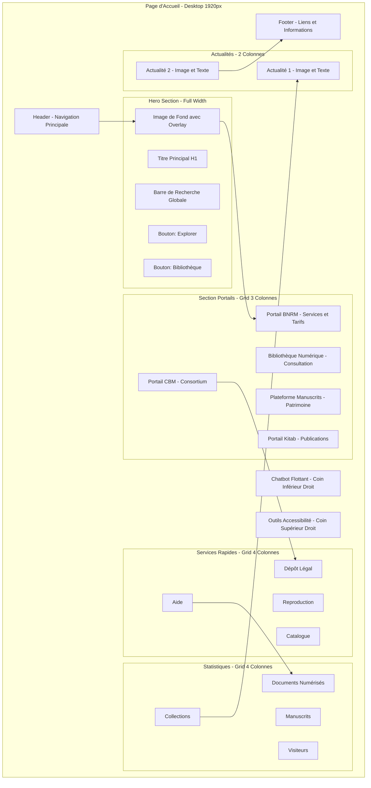
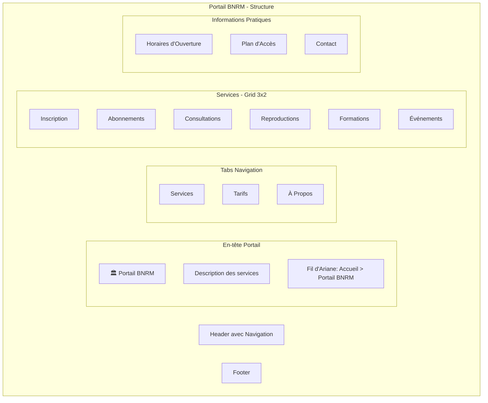
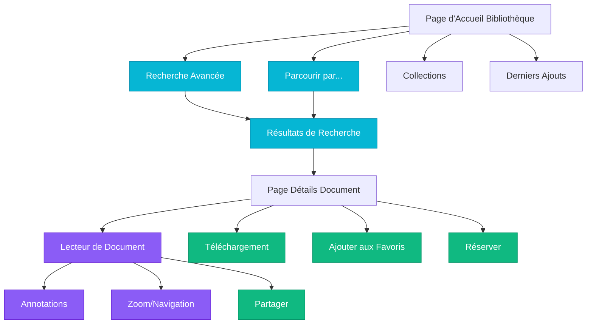
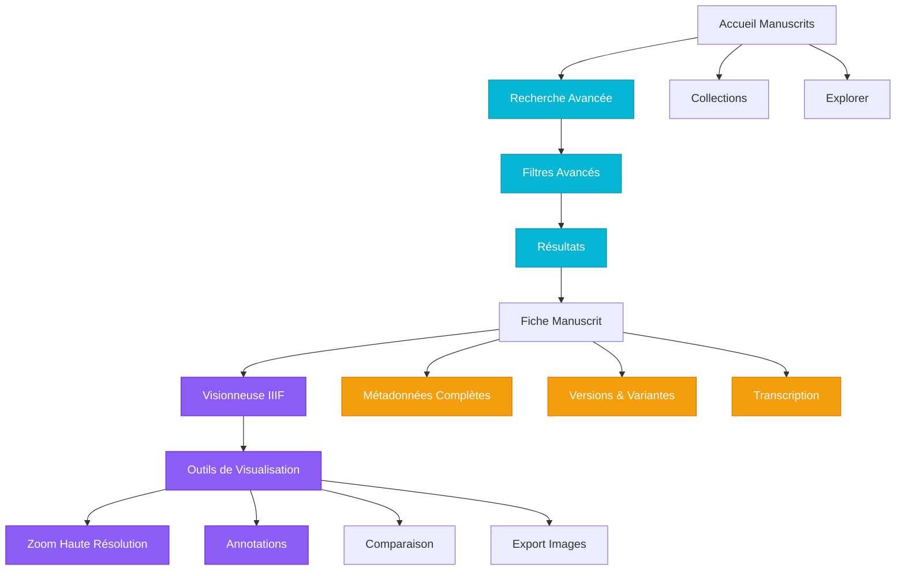
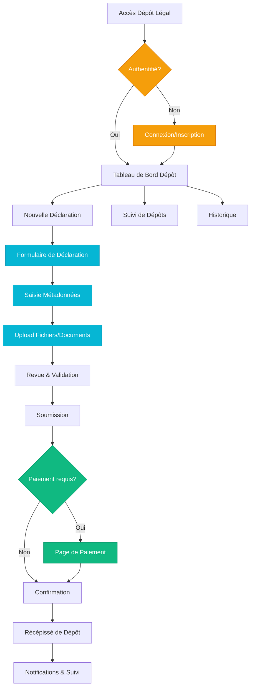

# Maquettes Fils de Fer - Portail BNRM

**Projet**: Mise en place du Portail Web institutionnel et de la Bibliothèque Numérique de la Bibliothèque Nationale du Royaume du Maroc

**Date**: Janvier 2025  
**Version**: 1.0

---

## Table des Matières

1. [Introduction](#introduction)
2. [Arborescence Générale](#arborescence-générale)
3. [Page d'Accueil](#page-daccueil)
4. [Portail BNRM](#portail-bnrm)
5. [Bibliothèque Numérique](#bibliothèque-numérique)
6. [Plateforme Manuscrits](#plateforme-manuscrits)
7. [Portail Kitab](#portail-kitab)
8. [Portail CBM](#portail-cbm)
9. [E-Services](#e-services)
10. [Espace Utilisateur](#espace-utilisateur)
11. [Déclinaison Multi-supports](#déclinaison-multi-supports)
12. [Principes d'Accessibilité](#principes-daccessibilité)

---

## Introduction

Ce document présente les maquettes fils de fer (wireframes) du portail web de la BNRM. Ces maquettes définissent:

- **Structures des pages**: Organisation des contenus, blocs d'information, zones de navigation
- **Navigation et ergonomie**: Emplacement et comportement des éléments interactifs
- **Responsivité**: Adaptation aux différents supports (desktop, tablette, mobile)
- **Accessibilité**: Conformité WCAG 2.1 AA
- **Fonctionnalités**: Zones dédiées aux services innovants (chatbot, recherche avancée, etc.)

### Légende des Diagrammes

```
┌─────────────┐  Conteneur principal
│   Header    │  Zone d'en-tête
├─────────────┤  Séparateur
│   Content   │  Zone de contenu
└─────────────┘  Pied de page

[Bouton]         Élément interactif
{Component}      Composant React
```

---

## Arborescence Générale

```mermaid
graph TD
    HOME[Page d'Accueil BNRM]
    
    %% Portails Principaux
    HOME --> BNRM[Portail BNRM]
    HOME --> KITAB[Portail Kitab]
    HOME --> CBM[Portail CBM]
    HOME --> DL[Bibliothèque Numérique]
    HOME --> MS[Plateforme Manuscrits]
    
    %% Services
    HOME --> SERVICES[E-Services]
    SERVICES --> DEPOT[Dépôt Légal]
    SERVICES --> REPRO[Reproduction]
    SERVICES --> CATALOG[Catalogue]
    SERVICES --> CULTURAL[Activités Culturelles]
    
    %% Authentification
    HOME --> AUTH[Authentification]
    AUTH --> SIGNUP[Inscription]
    AUTH --> LOGIN[Connexion]
    AUTH --> USER_SPACE[Espace Utilisateur]
    
    %% Informations
    HOME --> INFO[Informations]
    INFO --> ABOUT[À Propos]
    INFO --> HELP[Aide]
    INFO --> ACCESS[Accès & Horaires]
    INFO --> NEWS[Actualités]
    
    %% BNRM
    BNRM --> BNRM_SERVICES[Services BNRM]
    BNRM --> BNRM_TARIFS[Tarifs]
    BNRM --> BNRM_CULTURAL[Services Culturels]
    
    %% Services Culturels
    CULTURAL --> PROGRAMS[Programmes Culturels]
    CULTURAL --> EVENTS[Événements]
    CULTURAL --> WORKSHOPS[Ateliers]
    CULTURAL --> EXHIBITIONS[Expositions]
    
    %% Bibliothèque Numérique
    DL --> DL_SEARCH[Recherche]
    DL --> DL_BROWSE[Parcourir]
    DL --> DL_COLLECTIONS[Collections]
    DL --> DL_READER[Lecteur]
    
    %% Manuscrits
    MS --> MS_SEARCH[Recherche Manuscrits]
    MS --> MS_VIEWER[Visionneuse]
    MS --> MS_COLLECTIONS[Collections]
    
    %% Kitab
    KITAB --> KITAB_BIB[Bibliographie]
    KITAB --> KITAB_REP[Répertoires]
    KITAB --> KITAB_NEW[Nouveautés]
    
    %% User Space
    USER_SPACE --> MY_LIB[Ma Bibliothèque]
    USER_SPACE --> MY_MS[Mes Manuscrits]
    USER_SPACE --> PROFILE[Mon Profil]
    USER_SPACE --> WALLET[Portefeuille]
    
    classDef portal fill:#3b82f6,stroke:#1e40af,color:#fff
    classDef service fill:#10b981,stroke:#059669,color:#fff
    classDef user fill:#8b5cf6,stroke:#6d28d9,color:#fff
    classDef info fill:#06b6d4,stroke:#0891b2,color:#fff
    classDef cultural fill:#f59e0b,stroke:#d97706,color:#fff
    
    class HOME,BNRM,KITAB,CBM,DL,MS portal
    class SERVICES,DEPOT,REPRO,CATALOG service
    class AUTH,USER_SPACE,MY_LIB,MY_MS,PROFILE,WALLET user
    class INFO,ABOUT,HELP,ACCESS,NEWS info
    class CULTURAL,PROGRAMS,EVENTS,WORKSHOPS,EXHIBITIONS,BNRM_CULTURAL cultural
```



---

## Page d'Accueil

### Structure Desktop



### Wireframe Détaillé - Desktop

```
┌────────────────────────────────────────────────────────────────────────┐
│                        HEADER - Navigation                              │
│  [Logo BNRM]  Accueil  Portails  Services  À Propos    [FR|AR|EN] [🔍]│
│                                              [Connexion] [Mon Compte]   │
├────────────────────────────────────────────────────────────────────────┤
│                                                                         │
│                    HERO SECTION (Image de Fond)                        │
│                                                                         │
│              Bibliothèque Nationale du Royaume du Maroc                │
│           Patrimoine, Savoir et Culture au service de tous             │
│                                                                         │
│         ┌──────────────────────────────────────────────┐              │
│         │  🔍  Rechercher dans tout le portail...      │              │
│         └──────────────────────────────────────────────┘              │
│                                                                         │
│              [Explorer le Portail]  [Bibliothèque Numérique]          │
│                                                                         │
├────────────────────────────────────────────────────────────────────────┤
│                     NOS PORTAILS & PLATEFORMES                         │
│                                                                         │
│  ┌─────────────┐  ┌─────────────┐  ┌─────────────┐  ┌─────────────┐ │
│  │   📚 BNRM   │  │ 📖 Biblio   │  │ 📜 Manuscr. │  │  📗 Kitab   │ │
│  │             │  │  Numérique  │  │             │  │             │ │
│  │  Services   │  │             │  │  Patrimoine │  │Publications │ │
│  │  & Tarifs   │  │ Consultation│  │   Rare      │  │  Nationales │ │
│  │             │  │             │  │             │  │             │ │
│  │ [Découvrir] │  │ [Consulter] │  │ [Explorer]  │  │ [Parcourir] │ │
│  └─────────────┘  └─────────────┘  └─────────────┘  └─────────────┘ │
│                                                                         │
│  ┌─────────────┐                                                       │
│  │   🏛️ CBM    │                                                       │
│  │             │                                                       │
│  │  Consortium │                                                       │
│  │Bibliothèques│                                                       │
│  │             │                                                       │
│  │ [Accéder]   │                                                       │
│  └─────────────┘                                                       │
│                                                                         │
├────────────────────────────────────────────────────────────────────────┤
│                       SERVICES RAPIDES                                 │
│                                                                         │
│  ┌──────────────┐ ┌──────────────┐ ┌──────────────┐ ┌──────────────┐│
│  │ 📝 Dépôt     │ │ 🖨️ Demande   │ │ 🔍 Catalogue │ │ ❓ Centre    ││
│  │    Légal     │ │ Reproduction │ │  Métadonnées │ │   d'Aide     ││
│  │              │ │              │ │              │ │              ││
│  │ [Déclarer]   │ │ [Demander]   │ │ [Rechercher] │ │ [Consulter]  ││
│  └──────────────┘ └──────────────┘ └──────────────┘ └──────────────┘│
│                                                                         │
├────────────────────────────────────────────────────────────────────────┤
│                      QUELQUES CHIFFRES                                 │
│                                                                         │
│   ┌──────────┐    ┌──────────┐    ┌──────────┐    ┌──────────┐      │
│   │ 150,000  │    │  25,000  │    │ 500,000  │    │   450    │      │
│   │Documents │    │Manuscrits│    │Visiteurs │    │Collections│     │
│   │Numérisés │    │          │    │  /an     │    │          │      │
│   └──────────┘    └──────────┘    └──────────┘    └──────────┘      │
│                                                                         │
├────────────────────────────────────────────────────────────────────────┤
│                         ACTUALITÉS                                     │
│                                                                         │
│  ┌──────────────────────────────┐  ┌──────────────────────────────┐  │
│  │  [Image Actualité 1]         │  │  [Image Actualité 2]         │  │
│  │                              │  │                              │  │
│  │  Nouvelle exposition         │  │  Enrichissement collections  │  │
│  │  virtuelle disponible...     │  │  numériques...               │  │
│  │                              │  │                              │  │
│  │  [Lire la suite →]           │  │  [Lire la suite →]           │  │
│  └──────────────────────────────┘  └──────────────────────────────┘  │
│                                                                         │
├────────────────────────────────────────────────────────────────────────┤
│                           FOOTER                                       │
│                                                                         │
│  À Propos | Contact | Plan du Site | Mentions Légales | Accessibilité │
│  Horaires | Tarifs | FAQ | Réseaux Sociaux                            │
│                                                                         │
│  © 2025 Bibliothèque Nationale du Royaume du Maroc                    │
└────────────────────────────────────────────────────────────────────────┘

                                            ┌──────────┐
                                            │ 💬 Chat  │ Chatbot
                                            │   AI     │ Flottant
                                            └──────────┘

    ┌──────────┐
    │ ♿ 🔤 🎨 │  Outils Accessibilité
    └──────────┘
```

### Structure Mobile

```
┌─────────────────────────┐
│   ☰  [Logo]   🔍  👤   │ Header Compact
├─────────────────────────┤
│                         │
│    HERO IMAGE           │
│                         │
│  Titre Principal        │
│  Sous-titre             │
│                         │
│ [🔍 Rechercher...]      │
│                         │
│ [Explorer]              │
│ [Bibliothèque]          │
│                         │
├─────────────────────────┤
│  NOS PORTAILS           │
│                         │
│ ┌─────────────────────┐ │
│ │  📚 Portail BNRM    │ │
│ │  [Découvrir →]      │ │
│ └─────────────────────┘ │
│                         │
│ ┌─────────────────────┐ │
│ │  📖 Bibliothèque    │ │
│ │     Numérique       │ │
│ │  [Consulter →]      │ │
│ └─────────────────────┘ │
│                         │
│ ┌─────────────────────┐ │
│ │  📜 Manuscrits      │ │
│ │  [Explorer →]       │ │
│ └─────────────────────┘ │
│                         │
│ (Carousel horizontal)   │
│                         │
├─────────────────────────┤
│  SERVICES RAPIDES       │
│                         │
│ ┌──────────┐ ┌────────┐│
│ │Dépôt Lég.│ │Reproduc││
│ └──────────┘ └────────┘│
│ ┌──────────┐ ┌────────┐│
│ │Catalogue │ │  Aide  ││
│ └──────────┘ └────────┘│
│                         │
├─────────────────────────┤
│  CHIFFRES CLÉS          │
│                         │
│  150,000                │
│  Documents Numérisés    │
│                         │
│  25,000                 │
│  Manuscrits             │
│                         │
├─────────────────────────┤
│  ACTUALITÉS             │
│                         │
│ [Image]                 │
│ Titre Actualité 1       │
│ [Lire →]                │
│                         │
│ (Carousel)              │
│                         │
├─────────────────────────┤
│       FOOTER            │
│  Liens | Contact        │
└─────────────────────────┘
```

---

## Portail BNRM

### Structure Page Portail BNRM



### Wireframe BNRM - Desktop

```
┌────────────────────────────────────────────────────────────────────────┐
│  [Logo BNRM]  Accueil > Portail BNRM              [FR|AR|EN] [Compte]  │
├────────────────────────────────────────────────────────────────────────┤
│                                                                         │
│  ┌──────────────────────────────────────────────────────────────────┐ │
│  │  🏛️  PORTAIL BNRM                                   [Badge]      │ │
│  │                                                                  │ │
│  │  Gestion des services, tarifs et paramètres de la              │ │
│  │  Bibliothèque Nationale du Royaume du Maroc                     │ │
│  └──────────────────────────────────────────────────────────────────┘ │
│                                                                         │
│  ┌─────────────────────────────────────────────────────────────────┐  │
│  │  [Services]  [Tarifs]  [À Propos]  [Horaires]                   │  │
│  └─────────────────────────────────────────────────────────────────┘  │
│                                                                         │
│  ┌───────────────────────┐ ┌───────────────────────┐ ┌──────────────┐│
│  │  📝 Inscription       │ │  💳 Abonnements       │ │ 📖 Consulta- ││
│  │                       │ │                       │ │    tions     ││
│  │  Créez votre compte   │ │  Choisissez votre     │ │              ││
│  │  et accédez aux       │ │  formule d'abonnement │ │ Sur place ou ││
│  │  services             │ │                       │ │ en ligne     ││
│  │                       │ │  À partir de 100 MAD  │ │              ││
│  │  [S'inscrire →]       │ │  [Voir les tarifs →]  │ │ [Réserver →] ││
│  └───────────────────────┘ └───────────────────────┘ └──────────────┘│
│                                                                         │
│  ┌───────────────────────┐ ┌───────────────────────┐ ┌──────────────┐│
│  │  🖨️ Reproductions     │ │  🎓 Formations        │ │ 📅 Événe-    ││
│  │                       │ │                       │ │    ments     ││
│  │  Demandez des copies  │ │  Ateliers et          │ │              ││
│  │  certifiées ou        │ │  formations           │ │ Expositions, ││
│  │  numérisations        │ │  documentaires        │ │ conférences  ││
│  │                       │ │                       │ │              ││
│  │  [Demander →]         │ │  [S'inscrire →]       │ │ [Agenda →]   ││
│  └───────────────────────┘ └───────────────────────┘ └──────────────┘│
│                                                                         │
│  ┌─────────────────────────────────────────────────────────────────┐  │
│  │              INFORMATIONS PRATIQUES                              │  │
│  │                                                                  │  │
│  │  ┌──────────────────┐ ┌──────────────────┐ ┌─────────────────┐ │  │
│  │  │ ⏰ HORAIRES      │ │ 📍 ACCÈS         │ │ ✉️ CONTACT      │ │  │
│  │  │                 │ │                  │ │                 │ │  │
│  │  │ Lun-Ven: 9h-18h │ │ Av. Ibn Batouta  │ │ Tel: +212 ...   │ │  │
│  │  │ Sam: 9h-13h     │ │ Rabat            │ │ Email: ...      │ │  │
│  │  │ Dim: Fermé      │ │ [Plan →]         │ │ [Contacter →]   │ │  │
│  │  └──────────────────┘ └──────────────────┘ └─────────────────┘ │  │
│  └─────────────────────────────────────────────────────────────────┘  │
│                                                                         │
└────────────────────────────────────────────────────────────────────────┘
```

---

## Bibliothèque Numérique

### Flux de Navigation - Bibliothèque Numérique



### Wireframe - Page d'Accueil Bibliothèque Numérique

```
┌────────────────────────────────────────────────────────────────────────┐
│  [Logo]  Accueil > Bibliothèque Numérique         [FR|AR|EN] [Compte]  │
├────────────────────────────────────────────────────────────────────────┤
│                                                                         │
│                    HERO - IMAGE BANNIÈRE                               │
│                                                                         │
│              Bibliothèque Numérique de la BNRM                         │
│           Explorez notre patrimoine documentaire numérisé              │
│                                                                         │
│  ┌──────────────────────────────────────────────────────────────────┐ │
│  │  🔍  Rechercher par titre, auteur, sujet...        [Avancée →]   │ │
│  └──────────────────────────────────────────────────────────────────┘ │
│                                                                         │
│  [Parcourir par Thème] [Parcourir par Période] [Toutes les Collections]│
│                                                                         │
├────────────────────────────────────────────────────────────────────────┤
│                      DERNIERS AJOUTS                                   │
│                                                                         │
│  ┌──────────┐  ┌──────────┐  ┌──────────┐  ┌──────────┐  ┌────────┐  │
│  │ [Image]  │  │ [Image]  │  │ [Image]  │  │ [Image]  │  │ [Img]  │  │
│  │          │  │          │  │          │  │          │  │        │  │
│  │ Titre 1  │  │ Titre 2  │  │ Titre 3  │  │ Titre 4  │  │ Titre 5│  │
│  │ Auteur   │  │ Auteur   │  │ Auteur   │  │ Auteur   │  │ Auteur │  │
│  │ 2024     │  │ 2024     │  │ 2023     │  │ 2023     │  │ 2022   │  │
│  │          │  │          │  │          │  │          │  │        │  │
│  │[Consulter]│  │[Consulter]│  │[Consulter]│  │[Consulter]│  │[Voir]  │  │
│  └──────────┘  └──────────┘  └──────────┘  └──────────┘  └────────┘  │
│                                                                         │
│                    ◀  Carousel Navigation  ▶                           │
│                                                                         │
├────────────────────────────────────────────────────────────────────────┤
│                    COLLECTIONS EN VEDETTE                              │
│                                                                         │
│  ┌───────────────────────┐ ┌───────────────────────┐ ┌──────────────┐│
│  │  📚 Livres Rares      │ │  📰 Presse Historique │ │ 🎨 Affiches  ││
│  │                       │ │                       │ │              ││
│  │  2,500 documents      │ │  15,000 documents     │ │ 800 docs     ││
│  │                       │ │                       │ │              ││
│  │  [Explorer →]         │ │  [Explorer →]         │ │ [Explorer →] ││
│  └───────────────────────┘ └───────────────────────┘ └──────────────┘│
│                                                                         │
│  ┌───────────────────────┐ ┌───────────────────────┐ ┌──────────────┐│
│  │  🗺️ Cartes & Plans    │ │  📸 Photographies     │ │ 📜 Documents ││
│  │                       │ │   Anciennes           │ │   Officiels  ││
│  │  1,200 documents      │ │  5,000 documents      │ │ 3,000 docs   ││
│  │                       │ │                       │ │              ││
│  │  [Explorer →]         │ │  [Explorer →]         │ │ [Explorer →] ││
│  └───────────────────────┘ └───────────────────────┘ └──────────────┘│
│                                                                         │
├────────────────────────────────────────────────────────────────────────┤
│                    EXPLORER PAR THÈME                                  │
│                                                                         │
│  ┌──────────┐ ┌──────────┐ ┌──────────┐ ┌──────────┐ ┌──────────┐   │
│  │Histoire  │ │Littérat. │ │Sciences  │ │Arts      │ │Religion  │   │
│  │📖        │ │✍️         │ │🔬        │ │🎭        │ │🕌        │   │
│  └──────────┘ └──────────┘ └──────────┘ └──────────┘ └──────────┘   │
│                                                                         │
│  ┌──────────┐ ┌──────────┐ ┌──────────┐ ┌──────────┐                 │
│  │Géographie│ │Droit     │ │Économie  │ │Philosophie│                │
│  │🗺️        │ │⚖️         │ │💼        │ │🤔        │                │
│  └──────────┘ └──────────┘ └──────────┘ └──────────┘                 │
│                                                                         │
├────────────────────────────────────────────────────────────────────────┤
│                         ACTUALITÉS                                     │
│                                                                         │
│  ┌──────────────────────────────┐  ┌──────────────────────────────┐  │
│  │  [Image]                     │  │  [Image]                     │  │
│  │  Nouvelle exposition         │  │  100 nouveaux documents      │  │
│  │  virtuelle sur...            │  │  numérisés ce mois...        │  │
│  │  [Lire la suite →]           │  │  [Découvrir →]               │  │
│  └──────────────────────────────┘  └──────────────────────────────┘  │
│                                                                         │
├────────────────────────────────────────────────────────────────────────┤
│                         STATISTIQUES                                   │
│                                                                         │
│   📚 150,000 Documents  |  📖 25,000 Livres  |  📰 50,000 Périodiques  │
│                                                                         │
└────────────────────────────────────────────────────────────────────────┘
```

### Wireframe - Lecteur de Document

```
┌────────────────────────────────────────────────────────────────────────┐
│  [← Retour aux résultats]                    [Fermer ✕]               │
├────────────────────────────────────────────────────────────────────────┤
│                                                                         │
│  ┌─────────────────────────────────────────────────────────────────┐  │
│  │                    BARRE D'OUTILS                                │  │
│  │                                                                  │  │
│  │  [⊟ Plein écran] [📥 Télécharger] [🔍 Zoom] [↻ Rotation]       │  │
│  │  [📑 Table des matières] [🔖 Signets] [💬 Annoter] [🔗 Partager]│  │
│  │                                                                  │  │
│  │  Affichage: [● Simple page] [○ Double page]                     │  │
│  └─────────────────────────────────────────────────────────────────┘  │
│                                                                         │
│  ┌──────┐  ┌───────────────────────────────────────────┐  ┌──────┐   │
│  │      │  │                                           │  │      │   │
│  │ TOC  │  │                                           │  │ INFO │   │
│  │      │  │                                           │  │      │   │
│  │ Ch.1 │  │                                           │  │Titre:│   │
│  │ Ch.2 │  │                                           │  │...   │   │
│  │ Ch.3 │  │         ZONE DE LECTURE                   │  │      │   │
│  │ ...  │  │                                           │  │Auteur│   │
│  │      │  │         [Page du Document]                │  │...   │   │
│  │[△]   │  │                                           │  │      │   │
│  │[▽]   │  │                                           │  │Date: │   │
│  │      │  │                                           │  │2024  │   │
│  │      │  │                                           │  │      │   │
│  │      │  │                                           │  │Pages:│   │
│  │      │  │                                           │  │450   │   │
│  │      │  │                                           │  │      │   │
│  │[Masq.]│  │                                           │  │[Masq.]│  │
│  └──────┘  └───────────────────────────────────────────┘  └──────┘   │
│                                                                         │
│  ┌─────────────────────────────────────────────────────────────────┐  │
│  │              NAVIGATION DE PAGES                                 │  │
│  │                                                                  │  │
│  │  [◀◀ Première] [◀ Précédent]  Page: [___15___] / 450           │  │
│  │                              [Suivant ▶] [Dernière ▶▶]          │  │
│  │                                                                  │  │
│  │  ████████████░░░░░░░░░░░░░░░░░░░░░░░░░ 3%                       │  │
│  └─────────────────────────────────────────────────────────────────┘  │
│                                                                         │
├────────────────────────────────────────────────────────────────────────┤
│                    ACTIONS RAPIDES                                     │
│                                                                         │
│  [⭐ Ajouter aux Favoris] [📋 Citer] [💾 Sauvegarder la lecture]       │
│  [📧 Partager par email] [🔗 Copier le lien] [⚠️ Signaler un problème]│
│                                                                         │
└────────────────────────────────────────────────────────────────────────┘
```

---

## Plateforme Manuscrits

### Structure Plateforme Manuscrits



### Wireframe - Visionneuse Manuscrit

```
┌────────────────────────────────────────────────────────────────────────┐
│  [← Retour]  Manuscrit MS-2024-001                    [✕ Fermer]       │
├────────────────────────────────────────────────────────────────────────┤
│  ┌─────────────────────────────────────────────────────────────────┐  │
│  │  [⊟] [🔍+] [🔍-] [↻] [↺] [◧ Plein écran]                       │  │
│  │  [📏 Mesures] [🖊️ Annoter] [📊 Comparer] [💾 Télécharger]       │  │
│  │                                                                  │  │
│  │  Affichage: [● Page simple] [○ Pages doubles] [○ Miniatures]    │  │
│  └─────────────────────────────────────────────────────────────────┘  │
│                                                                         │
│  ┌────────┐  ┌────────────────────────────────────────┐  ┌─────────┐ │
│  │Miniatu-│  │                                        │  │Métadon- │ │
│  │res     │  │                                        │  │nées     │ │
│  │        │  │                                        │  │         │ │
│  │[img] 1 │  │                                        │  │Titre:   │ │
│  │[img] 2 │  │                                        │  │Kitab...│ │
│  │[img] 3 │  │       MANUSCRIT - HAUTE RÉSOLUTION     │  │         │ │
│  │...     │  │                                        │  │Auteur:  │ │
│  │        │  │      [Image Manuscrit Folio Recto]     │  │Ibn...   │ │
│  │        │  │                                        │  │         │ │
│  │Navigation│ │                                        │  │Datation:│ │
│  │        │  │                                        │  │XVe s.   │ │
│  │Page: 12│  │                                        │  │         │ │
│  │        │  │                                        │  │Support: │ │
│  │[△]     │  │                                        │  │Papier   │ │
│  │[▽]     │  │                                        │  │         │ │
│  │        │  │                                        │  │Dimensions│
│  │[Masquer]│  │                                        │  │25x18cm  │ │
│  └────────┘  └────────────────────────────────────────┘  │         │ │
│                                                            │Folios:  │ │
│  ┌───────────────────────────────────────────────────────│120      │ │
│  │              NAVIGATION & CONTRÔLES                   │         │ │
│  │                                                        │État:    │ │
│  │  [◀◀] [◀]  Folio: [__12__] / 120  [▶] [▶▶]          │Bon      │ │
│  │                                                        │         │ │
│  │  ████████░░░░░░░░░░░░░░░░░░░░░░░░░░ 10%              │[Voir +] │ │
│  │                                                        │         │ │
│  │  [Recto] / [Verso]                                    │[Masquer]│ │
│  └────────────────────────────────────────────────────────└─────────┘ │
│                                                                         │
│  ┌─────────────────────────────────────────────────────────────────┐  │
│  │                        ONGLETS                                   │  │
│  │  [Visualisation] [Transcription] [Annotations] [Versions]       │  │
│  └─────────────────────────────────────────────────────────────────┘  │
│                                                                         │
│  ┌─────────────────────────────────────────────────────────────────┐  │
│  │  TRANSCRIPTION (si disponible)                                  │  │
│  │                                                                  │  │
│  │  [Texte transcrit en arabe classique...]                        │  │
│  │                                                                  │  │
│  │  [Afficher la traduction française]                             │  │
│  └─────────────────────────────────────────────────────────────────┘  │
│                                                                         │
└────────────────────────────────────────────────────────────────────────┘
```

---

## Portail Kitab

### Wireframe - Portail Kitab

```
┌────────────────────────────────────────────────────────────────────────┐
│  [Logo]  Accueil > Portail Kitab                  [FR|AR|EN] [Compte]  │
├────────────────────────────────────────────────────────────────────────┤
│                                                                         │
│  ┌──────────────────────────────────────────────────────────────────┐ │
│  │  📗 PORTAIL KITAB                                                │ │
│  │                                                                  │ │
│  │  Publications & Production Éditoriale Nationale                 │ │
│  └──────────────────────────────────────────────────────────────────┘ │
│                                                                         │
│  ┌─────────────────────────────────────────────────────────────────┐  │
│  │ [À Propos] [Nouvelles Parutions] [Bibliographie] [Répertoires]  │  │
│  │ [À Paraître] [Statistiques] [FAQ]                               │  │
│  └─────────────────────────────────────────────────────────────────┘  │
│                                                                         │
├────────────────────────────────────────────────────────────────────────┤
│                    NOUVELLES PARUTIONS                                 │
│                                                                         │
│  ┌──────────┐  ┌──────────┐  ┌──────────┐  ┌──────────┐  ┌────────┐  │
│  │ [Couv.]  │  │ [Couv.]  │  │ [Couv.]  │  │ [Couv.]  │  │ [Couv.]│  │
│  │          │  │          │  │          │  │          │  │        │  │
│  │ Titre    │  │ Titre    │  │ Titre    │  │ Titre    │  │ Titre  │  │
│  │ Auteur   │  │ Auteur   │  │ Auteur   │  │ Auteur   │  │ Auteur │  │
│  │ Éditeur  │  │ Éditeur  │  │ Éditeur  │  │ Éditeur  │  │ Éditeur│  │
│  │ ISBN     │  │ ISBN     │  │ ISBN     │  │ ISBN     │  │ ISBN   │  │
│  │          │  │          │  │          │  │          │  │        │  │
│  │[Voir +]  │  │[Voir +]  │  │[Voir +]  │  │[Voir +]  │  │[Voir +]│  │
│  └──────────┘  └──────────┘  └──────────┘  └──────────┘  └────────┘  │
│                                                                         │
├────────────────────────────────────────────────────────────────────────┤
│                   BIBLIOGRAPHIE NATIONALE                              │
│                                                                         │
│  ┌──────────────────────────────────────────────────────────────────┐ │
│  │  🔍  Rechercher dans la bibliographie nationale...               │ │
│  │      [Par titre] [Par auteur] [Par ISBN] [Par éditeur]          │ │
│  └──────────────────────────────────────────────────────────────────┘ │
│                                                                         │
│  📊 Statistiques: 15,248 ouvrages répertoriés en 2024                 │
│                                                                         │
│  [📥 Télécharger la bibliographie 2024 (PDF)]                         │
│  [📥 Télécharger la bibliographie 2023 (PDF)]                         │
│                                                                         │
├────────────────────────────────────────────────────────────────────────┤
│                  RÉPERTOIRES PROFESSIONNELS                            │
│                                                                         │
│  ┌──────────────┐ ┌──────────────┐ ┌──────────────┐ ┌──────────────┐│
│  │ ✍️ Auteurs   │ │ 📚 Éditeurs  │ │ 🖨️ Imprimeurs│ │ 📦 Distribu- ││
│  │              │ │              │ │              │ │    teurs     ││
│  │ 2,500        │ │ 450          │ │ 320          │ │ 180          ││
│  │ inscrits     │ │ maisons      │ │ certifiés    │ │ actifs       ││
│  │              │ │              │ │              │ │              ││
│  │ [Consulter →]│ │ [Consulter →]│ │ [Consulter →]│ │ [Consulter →]││
│  └──────────────┘ └──────────────┘ └──────────────┘ └──────────────┘│
│                                                                         │
│  [S'inscrire en tant que professionnel →]                             │
│                                                                         │
├────────────────────────────────────────────────────────────────────────┤
│                      À PARAÎTRE                                        │
│                                                                         │
│  Livres annoncés pour publication prochaine:                          │
│                                                                         │
│  • "Titre du livre 1" - Auteur 1 - Éditeur 1 (Mars 2025)             │
│  • "Titre du livre 2" - Auteur 2 - Éditeur 2 (Mars 2025)             │
│  • "Titre du livre 3" - Auteur 3 - Éditeur 3 (Avril 2025)            │
│                                                                         │
│  [Voir tous les à paraître →]                                         │
│                                                                         │
└────────────────────────────────────────────────────────────────────────┘
```

---

## Portail CBM

### Wireframe - Portail CBM

```
┌────────────────────────────────────────────────────────────────────────┐
│  [Logo]  Accueil > Portail CBM                    [FR|AR|EN] [Compte]  │
├────────────────────────────────────────────────────────────────────────┤
│                                                                         │
│  ┌──────────────────────────────────────────────────────────────────┐ │
│  │  🏛️ PORTAIL CBM                                                  │ │
│  │                                                                  │ │
│  │  Catalogue des Bibliothèques Marocaines                         │ │
│  │  Consortium National de Coopération Bibliographique             │ │
│  └──────────────────────────────────────────────────────────────────┘ │
│                                                                         │
│  ┌─────────────────────────────────────────────────────────────────┐  │
│  │ [Objectifs] [Organes de Gestion] [Plan d'Actions] [Recherche]   │  │
│  │ [Adhésion] [Ressources] [Statistiques]                          │  │
│  └─────────────────────────────────────────────────────────────────┘  │
│                                                                         │
├────────────────────────────────────────────────────────────────────────┤
│                    À PROPOS DU CBM                                     │
│                                                                         │
│  Le Catalogue des Bibliothèques Marocaines (CBM) est un consortium    │
│  national qui rassemble les bibliothèques du Royaume pour partager    │
│  leurs ressources et mutualiser leurs catalogues.                     │
│                                                                         │
│  ┌───────────────────────┐ ┌───────────────────────┐ ┌──────────────┐│
│  │ 🎯 OBJECTIFS          │ │ 📊 CHIFFRES CLÉS      │ │ 🤝 MEMBRES   ││
│  │                       │ │                       │ │              ││
│  │ • Mutualisation       │ │ • 85 bibliothèques    │ │ • Universités││
│  │ • Coopération         │ │ • 2.5M de notices     │ │ • Publiques  ││
│  │ • Visibilité          │ │ • 500K utilisateurs   │ │ • Spécialisé.││
│  │ • Normalisation       │ │ • 15 ans d'existence  │ │ • Associativ.││
│  │                       │ │                       │ │              ││
│  └───────────────────────┘ └───────────────────────┘ └──────────────┘│
│                                                                         │
├────────────────────────────────────────────────────────────────────────┤
│                    RECHERCHE DANS LE CBM                               │
│                                                                         │
│  ┌──────────────────────────────────────────────────────────────────┐ │
│  │  🔍  Rechercher dans toutes les bibliothèques du réseau...       │ │
│  │                                                                  │ │
│  │  [Recherche simple] [Recherche avancée] [Par bibliothèque]      │ │
│  └──────────────────────────────────────────────────────────────────┘ │
│                                                                         │
│  Recherche fédérée dans:                                              │
│  ✓ Catalogues locaux  ✓ Bases de données  ✓ Ressources numériques    │
│                                                                         │
├────────────────────────────────────────────────────────────────────────┤
│                  BIBLIOTHÈQUES MEMBRES                                 │
│                                                                         │
│  ┌──────────────┐ ┌──────────────┐ ┌──────────────┐ ┌──────────────┐│
│  │ 🏛️ BNRM      │ │ 🎓 Univ.     │ │ 📚 BM Casa   │ │ 📖 BM Rabat  ││
│  │              │ │   Mohamed V  │ │              │ │              ││
│  │ Bibliothèque │ │              │ │ Bibliothèque │ │ Bibliothèque ││
│  │ Nationale    │ │ Université   │ │ Municipale   │ │ Municipale   ││
│  │              │ │              │ │              │ │              ││
│  │ [Voir →]     │ │ [Voir →]     │ │ [Voir →]     │ │ [Voir →]     ││
│  └──────────────┘ └──────────────┘ └──────────────┘ └──────────────┘│
│                                                                         │
│  [Voir toutes les bibliothèques membres (85) →]                       │
│                                                                         │
├────────────────────────────────────────────────────────────────────────┤
│                      ADHÉSION AU CBM                                   │
│                                                                         │
│  Votre bibliothèque souhaite rejoindre le consortium?                 │
│                                                                         │
│  ✓ Mutualisation des ressources                                       │
│  ✓ Catalogue commun                                                   │
│  ✓ Formation continue                                                 │
│  ✓ Assistance technique                                               │
│                                                                         │
│  [📝 Formulaire d'adhésion →]  [📄 Télécharger la charte →]           │
│                                                                         │
├────────────────────────────────────────────────────────────────────────┤
│                    PLAN D'ACTIONS 2024-2026                            │
│                                                                         │
│  📌 Axes stratégiques:                                                │
│                                                                         │
│  1. Extension du réseau (objectif: 100 bibliothèques)                 │
│  2. Migration vers nouveau SIGB mutualisé                             │
│  3. Normalisation des pratiques catalogiques                          │
│  4. Formation des professionnels                                      │
│  5. Développement des services numériques                             │
│                                                                         │
│  [📥 Télécharger le plan d'actions complet (PDF)]                     │
│                                                                         │
└────────────────────────────────────────────────────────────────────────┘
```

---

## E-Services

### Flux - Dépôt Légal



### Wireframe - Déclaration de Dépôt Légal

```
┌────────────────────────────────────────────────────────────────────────┐
│  [Logo]  Mon Espace > Dépôt Légal > Nouvelle Déclaration  [Déconnexion]│
├────────────────────────────────────────────────────────────────────────┤
│                                                                         │
│  ┌──────────────────────────────────────────────────────────────────┐ │
│  │  📝 NOUVELLE DÉCLARATION DE DÉPÔT LÉGAL                          │ │
│  │                                                                  │ │
│  │  Étapes: ① Identification  ② Métadonnées  ③ Documents  ④ Validation│
│  └──────────────────────────────────────────────────────────────────┘ │
│                                                                         │
│  ┌─────────────────────────────────────────────────────────────────┐  │
│  │              ÉTAPE 1: IDENTIFICATION                             │  │
│  │                                                                  │  │
│  │  Type de document *                                              │  │
│  │  ○ Livre                                                         │  │
│  │  ○ Périodique (journal/magazine)                                 │  │
│  │  ○ Document audiovisuel                                          │  │
│  │  ○ Document électronique                                         │  │
│  │  ○ Autre                                                         │  │
│  │                                                                  │  │
│  │  Vous déclarez en tant que: *                                    │  │
│  │  ○ Auteur                                                        │  │
│  │  ○ Éditeur                                                       │  │
│  │  ○ Producteur                                                    │  │
│  │  ○ Imprimeur                                                     │  │
│  │                                                                  │  │
│  └─────────────────────────────────────────────────────────────────┘  │
│                                                                         │
│  ┌─────────────────────────────────────────────────────────────────┐  │
│  │              ÉTAPE 2: MÉTADONNÉES                                │  │
│  │                                                                  │  │
│  │  Titre de l'ouvrage *                                            │  │
│  │  [________________________________]                              │  │
│  │                                                                  │  │
│  │  Auteur(s) *                                                     │  │
│  │  [________________________________] [+ Ajouter un auteur]        │  │
│  │                                                                  │  │
│  │  ISBN (si disponible)                                            │  │
│  │  [___-__-_____-___-_]                                           │  │
│  │                                                                  │  │
│  │  Éditeur *                                                       │  │
│  │  [________________________________]                              │  │
│  │                                                                  │  │
│  │  Lieu d'édition *                                                │  │
│  │  [________________________________]                              │  │
│  │                                                                  │  │
│  │  Date de publication *                                           │  │
│  │  [JJ] / [MM] / [AAAA]                                           │  │
│  │                                                                  │  │
│  │  Langue(s) *                                                     │  │
│  │  ☑ Arabe  ☐ Français  ☐ Anglais  ☐ Autre: [_______]            │  │
│  │                                                                  │  │
│  │  Nombre de pages                                                 │  │
│  │  [_____]                                                         │  │
│  │                                                                  │  │
│  │  Tirage (nombre d'exemplaires)                                   │  │
│  │  [_____]                                                         │  │
│  │                                                                  │  │
│  │  Prix de vente public (MAD)                                      │  │
│  │  [_____]                                                         │  │
│  │                                                                  │  │
│  └─────────────────────────────────────────────────────────────────┘  │
│                                                                         │
│  ┌─────────────────────────────────────────────────────────────────┐  │
│  │              ÉTAPE 3: DOCUMENTS À DÉPOSER                        │  │
│  │                                                                  │  │
│  │  Documents physiques à déposer *                                 │  │
│  │  Nombre d'exemplaires: [__2__] (minimum requis: 2)              │  │
│  │                                                                  │  │
│  │  Version numérique (optionnel mais recommandé)                   │  │
│  │  ┌──────────────────────────────────────────────────┐           │  │
│  │  │  📁 Glisser-déposer le fichier PDF ici          │           │  │
│  │  │     ou [Parcourir...]                            │           │  │
│  │  │                                                  │           │  │
│  │  │  Formats acceptés: PDF                           │           │  │
│  │  │  Taille max: 50 MB                               │           │  │
│  │  └──────────────────────────────────────────────────┘           │  │
│  │                                                                  │  │
│  │  Document déposé:                                                │  │
│  │  ✓ mon_livre.pdf (15.2 MB) [✕ Supprimer]                        │  │
│  │                                                                  │  │
│  └─────────────────────────────────────────────────────────────────┘  │
│                                                                         │
│  ┌─────────────────────────────────────────────────────────────────┐  │
│  │              ÉTAPE 4: REVUE & VALIDATION                         │  │
│  │                                                                  │  │
│  │  Récapitulatif de votre déclaration:                             │  │
│  │                                                                  │  │
│  │  Type: Livre                                                     │  │
│  │  Titre: "Mon Titre de Livre"                                    │  │
│  │  Auteur: Jean Dupont                                             │  │
│  │  ISBN: 978-9920-12345-6                                          │  │
│  │  Éditeur: Éditions Exemple                                      │  │
│  │  Date: 15/01/2025                                                │  │
│  │  Langue: Français                                                │  │
│  │  Pages: 250                                                      │  │
│  │  Tirage: 1000 exemplaires                                        │  │
│  │                                                                  │  │
│  │  Documents:                                                      │  │
│  │  • 2 exemplaires physiques à déposer                             │  │
│  │  • 1 version numérique (PDF)                                     │  │
│  │                                                                  │  │
│  │  ☑ J'atteste que les informations fournies sont exactes         │  │
│  │  ☑ J'ai lu et j'accepte les conditions du dépôt légal           │  │
│  │                                                                  │  │
│  │  [◀ Étape précédente]              [Soumettre la déclaration →] │  │
│  └─────────────────────────────────────────────────────────────────┘  │
│                                                                         │
└────────────────────────────────────────────────────────────────────────┘
```

---

## Espace Utilisateur

### Structure Espace Utilisateur

```mermaid
graph TB
    USER_HOME[Espace Utilisateur]
    
    USER_HOME --> MY_PROFILE[Mon Profil]
    USER_HOME --> MY_LIBRARY[Ma Bibliothèque]
    USER_HOME --> MY_MANUSCRIPTS[Mes Manuscrits]
    USER_HOME --> MY_WALLET[Mon Portefeuille]
    USER_HOME --> MY_REQUESTS[Mes Demandes]
    USER_HOME --> MY_SETTINGS[Paramètres]
    
    MY_PROFILE --> PROFILE_INFO[Informations Personnelles]
    MY_PROFILE --> PROFILE_SECURITY[Sécurité]
    MY_PROFILE --> PROFILE_PREFS[Préférences]
    
    MY_LIBRARY --> LIB_FAVORITES[Favoris]
    MY_LIBRARY --> LIB_READING[En Cours de Lecture]
    MY_LIBRARY --> LIB_HISTORY[Historique]
    MY_LIBRARY --> LIB_BOOKMARKS[Signets]
    MY_LIBRARY --> LIB_NOTES[Notes & Annotations]
    
    MY_MANUSCRIPTS --> MS_FAVORITES[Manuscrits Favoris]
    MY_MANUSCRIPTS --> MS_REQUESTS[Demandes d'Accès]
    MY_MANUSCRIPTS --> MS_ANNOTATIONS[Annotations]
    
    MY_WALLET --> WALLET_BALANCE[Solde]
    MY_WALLET --> WALLET_HISTORY[Historique Transactions]
    MY_WALLET --> WALLET_RECHARGE[Recharger]
    MY_WALLET --> WALLET_SUBSCRIPTIONS[Abonnements]
    
    MY_REQUESTS --> REQ_DEPOSIT[Dépôts Légaux]
    MY_REQUESTS --> REQ_REPRO[Reproductions]
    MY_REQUESTS --> REQ_ACCESS[Accès Spéciaux]
    MY_REQUESTS --> REQ_RESERVATIONS[Réservations]
    
    classDef profile fill:#8b5cf6,stroke:#6d28d9,color:#fff
    classDef library fill:#06b6d4,stroke:#0891b2,color:#fff
    classDef wallet fill:#10b981,stroke:#059669,color:#fff
    classDef requests fill:#f59e0b,stroke:#d97706,color:#fff
    
    class USER_HOME,MY_PROFILE,PROFILE_INFO profile
    class MY_LIBRARY,LIB_FAVORITES,LIB_READING library
    class MY_WALLET,WALLET_BALANCE,WALLET_RECHARGE wallet
    class MY_REQUESTS,REQ_DEPOSIT,REQ_REPRO requests
```



### Wireframe - Dashboard Utilisateur

```
┌────────────────────────────────────────────────────────────────────────┐
│  [Logo]  Mon Espace                       [Notifications 🔔] [Compte ▼]│
├────────────────────────────────────────────────────────────────────────┤
│                                                                         │
│  ┌──────────────────────────────────────────────────────────────────┐ │
│  │  👤 Bonjour, Jean Dupont                        Profil: Chercheur │ │
│  │                                                  Membre depuis 2023│ │
│  └──────────────────────────────────────────────────────────────────┘ │
│                                                                         │
│  ┌──────────┐  ┌──────────┐  ┌──────────┐  ┌──────────┐  ┌────────┐  │
│  │ 📚 Ma    │  │ 📜 Mes   │  │ 💳 Mon   │  │ 📝 Mes   │  │ ⚙️ Param│ │
│  │ Bibliot. │  │ Manuscr. │  │ Porte-   │  │ Demandes │  │        │  │
│  │          │  │          │  │ feuille  │  │          │  │        │  │
│  │ [Accéder]│  │ [Accéder]│  │ [Accéder]│  │ [Accéder]│  │[Accéder]│ │
│  └──────────┘  └──────────┘  └──────────┘  └──────────┘  └────────┘  │
│                                                                         │
├────────────────────────────────────────────────────────────────────────┤
│                    ACTIVITÉ RÉCENTE                                    │
│                                                                         │
│  ┌─────────────────────────────────────────────────────────────────┐  │
│  │  📖 Documents récemment consultés                                │  │
│  │                                                                  │  │
│  │  ┌──────┐  ┌──────┐  ┌──────┐  ┌──────┐                        │  │
│  │  │[Img] │  │[Img] │  │[Img] │  │[Img] │                        │  │
│  │  │      │  │      │  │      │  │      │                        │  │
│  │  │Titre1│  │Titre2│  │Titre3│  │Titre4│                        │  │
│  │  │      │  │      │  │      │  │      │                        │  │
│  │  │[Ouvr.]│  │[Ouvr.]│  │[Ouvr.]│  │[Ouvr.]│                        │  │
│  │  └──────┘  └──────┘  └──────┘  └──────┘                        │  │
│  └─────────────────────────────────────────────────────────────────┘  │
│                                                                         │
│  ┌─────────────────────────────────────────────────────────────────┐  │
│  │  ⭐ Mes Favoris (15)                                [Tout voir →]│  │
│  │                                                                  │  │
│  │  • "Histoire du Maroc" - Ajouté il y a 2 jours                  │  │
│  │  • "Manuscrit MS-2024-045" - Ajouté il y a 5 jours              │  │
│  │  • "Architecture traditionnelle" - Ajouté il y a 1 semaine      │  │
│  └─────────────────────────────────────────────────────────────────┘  │
│                                                                         │
├────────────────────────────────────────────────────────────────────────┤
│                    MES DEMANDES EN COURS                               │
│                                                                         │
│  ┌───────────────────────┐ ┌───────────────────────┐ ┌──────────────┐│
│  │ 📝 Dépôt Légal        │ │ 🖨️ Reproduction       │ │ 🔓 Accès     ││
│  │                       │ │                       │ │   Spécial    ││
│  │ Réf: DL-2025-001      │ │ Réf: REP-2025-045     │ │ Réf: ACC-067 ││
│  │ Statut: En traitement │ │ Statut: Approuvée     │ │ En attente   ││
│  │                       │ │                       │ │              ││
│  │ [Suivre →]            │ │ [Télécharger →]       │ │ [Détails →]  ││
│  └───────────────────────┘ └───────────────────────┘ └──────────────┘│
│                                                                         │
├────────────────────────────────────────────────────────────────────────┤
│                    MON PORTEFEUILLE                                    │
│                                                                         │
│  ┌─────────────────────────────────────────────────────────────────┐  │
│  │  💳 Solde actuel: 450.00 MAD                                     │  │
│  │                                                                  │  │
│  │  [Recharger mon compte]  [Voir l'historique]                    │  │
│  │                                                                  │  │
│  │  Abonnements actifs:                                             │  │
│  │  ✓ Abonnement Premium - Expire le 15/06/2025                    │  │
│  │  ✓ Accès Manuscrits Rares - Expire le 01/09/2025                │  │
│  └─────────────────────────────────────────────────────────────────┘  │
│                                                                         │
├────────────────────────────────────────────────────────────────────────┤
│                    STATISTIQUES PERSONNELLES                           │
│                                                                         │
│  ┌──────────────┐ ┌──────────────┐ ┌──────────────┐ ┌──────────────┐│
│  │ 📖 Documents │ │ ⏱️ Temps de  │ │ 📝 Annotations│ │ 💾 Téléchar- ││
│  │   Consultés  │ │   Lecture    │ │   Créées     │ │   gements    ││
│  │              │ │              │ │              │ │              ││
│  │     342      │ │   48h 30min  │ │     127      │ │      89      ││
│  └──────────────┘ └──────────────┘ └──────────────┘ └──────────────┘│
│                                                                         │
└────────────────────────────────────────────────────────────────────────┘
```

---

## Déclinaison Multi-supports

### Principes de Responsivité

```mermaid
graph TB
    RESPONSIVE[Design Responsive]
    
    RESPONSIVE --> DESKTOP[Desktop > 1024px]
    RESPONSIVE --> TABLET[Tablette 768-1023px]
    RESPONSIVE --> MOBILE[Mobile < 768px]
    
    DESKTOP --> DESK_NAV[Navigation Horizontale Complète]
    DESKTOP --> DESK_GRID[Grilles 3-4 Colonnes]
    DESKTOP --> DESK_SIDEBAR[Sidebars Visibles]
    DESKTOP --> DESK_HOVER[Interactions Hover]
    
    TABLET --> TAB_NAV[Navigation Adaptée]
    TABLET --> TAB_GRID[Grilles 2 Colonnes]
    TABLET --> TAB_SIDEBAR[Sidebars Collapsibles]
    TABLET --> TAB_TOUCH[Tactile Optimisé]
    
    MOBILE --> MOB_MENU[Menu Hamburger]
    MOBILE --> MOB_STACK[Layout Vertical]
    MOBILE --> MOB_TOUCH[Boutons Tactiles Larges]
    MOBILE --> MOB_SWIPE[Gestes Swipe]
    
    classDef desktop fill:#3b82f6,stroke:#1e40af,color:#fff
    classDef tablet fill:#10b981,stroke:#059669,color:#fff
    classDef mobile fill:#f59e0b,stroke:#d97706,color:#fff
    
    class DESKTOP,DESK_NAV,DESK_GRID desktop
    class TABLET,TAB_NAV,TAB_GRID tablet
    class MOBILE,MOB_MENU,MOB_STACK mobile
```



### Comparaison Layouts

```
┌─────────────────────────────────────────────────────────────────────┐
│                          DESKTOP (1920px)                            │
│  ┌────────────────────────────────────────────────────────────────┐ │
│  │ [Logo]  Nav1  Nav2  Nav3  Nav4  Nav5       [Search] [Lang] [👤]│ │
│  ├────────────────────────────────────────────────────────────────┤ │
│  │                        Content Area                            │ │
│  │  ┌──────┐ ┌──────┐ ┌──────┐ ┌──────┐                          │ │
│  │  │ Card │ │ Card │ │ Card │ │ Card │  (4 colonnes)            │ │
│  │  └──────┘ └──────┘ └──────┘ └──────┘                          │ │
│  └────────────────────────────────────────────────────────────────┘ │
└─────────────────────────────────────────────────────────────────────┘

┌──────────────────────────────────────────────┐
│         TABLETTE (768px)                     │
│  ┌──────────────────────────────────────┐   │
│  │ [Logo]  Nav ▼    [Search] [Lang] [👤]│   │
│  ├──────────────────────────────────────┤   │
│  │          Content Area                │   │
│  │  ┌──────────┐ ┌──────────┐           │   │
│  │  │   Card   │ │   Card   │ (2 col.)  │   │
│  │  └──────────┘ └──────────┘           │   │
│  │  ┌──────────┐ ┌──────────┐           │   │
│  │  │   Card   │ │   Card   │           │   │
│  │  └──────────┘ └──────────┘           │   │
│  └──────────────────────────────────────┘   │
└──────────────────────────────────────────────┘

┌─────────────────────────┐
│   MOBILE (375px)        │
│  ┌────────────────────┐ │
│  │ ☰ [Logo]    🔍  👤 │ │
│  ├────────────────────┤ │
│  │   Content Area     │ │
│  │  ┌──────────────┐  │ │
│  │  │     Card     │  │ │
│  │  └──────────────┘  │ │
│  │  ┌──────────────┐  │ │
│  │  │     Card     │  │ │
│  │  └──────────────┘  │ │
│  │  ┌──────────────┐  │ │
│  │  │     Card     │  │ │
│  │  └──────────────┘  │ │
│  │   (1 colonne)      │ │
│  └────────────────────┘ │
└─────────────────────────┘
```

---

## Principes d'Accessibilité

### Conformité WCAG 2.1 AA

```mermaid
graph TB
    WCAG[Accessibilité WCAG 2.1 AA]
    
    WCAG --> PERCEIVABLE[1. Perceptible]
    WCAG --> OPERABLE[2. Utilisable]
    WCAG --> UNDERSTANDABLE[3. Compréhensible]
    WCAG --> ROBUST[4. Robuste]
    
    PERCEIVABLE --> P1[Textes Alternatifs Images]
    PERCEIVABLE --> P2[Contrastes Suffisants]
    PERCEIVABLE --> P3[Redimensionnement Texte]
    PERCEIVABLE --> P4[Contenus Audio/Vidéo Accessibles]
    
    OPERABLE --> O1[Navigation Clavier Complète]
    OPERABLE --> O2[Temps Suffisant]
    OPERABLE --> O3[Pas de Clignotements]
    OPERABLE --> O4[Navigation Claire]
    
    UNDERSTANDABLE --> U1[Langue Déclarée]
    UNDERSTANDABLE --> U2[Navigation Prévisible]
    UNDERSTANDABLE --> U3[Assistance à la Saisie]
    UNDERSTANDABLE --> U4[Gestion des Erreurs]
    
    ROBUST --> R1[HTML Valide]
    ROBUST --> R2[ARIA Landmarks]
    ROBUST --> R3[Compatibilité Technologies Assistives]
    
    classDef wcag fill:#8b5cf6,stroke:#6d28d9,color:#fff
    classDef principle fill:#06b6d4,stroke:#0891b2,color:#fff
    
    class WCAG wcag
    class PERCEIVABLE,OPERABLE,UNDERSTANDABLE,ROBUST principle
```



### Outils d'Accessibilité

```
┌────────────────────────────────────────────────────────────────────────┐
│              OUTILS D'ACCESSIBILITÉ (Coin Supérieur Droit)             │
│                                                                         │
│  ┌──────────────────────────────────────────────────────────────────┐ │
│  │  ♿ ACCESSIBILITÉ                                          [Fermer]│ │
│  │                                                                  │ │
│  │  👁️ VISUEL                                                       │ │
│  │  ┌────────────────────────────────────────────────────────────┐ │ │
│  │  │ Taille du texte:  [A-] [A] [A+]                           │ │ │
│  │  │ Contraste:        [Normal] [Élevé] [Inversé]              │ │ │
│  │  │ Police:           [Standard] [Dyslexie] [Sans-Serif]      │ │ │
│  │  │ Espacement:       [─] [=] [+]                             │ │ │
│  │  │ Curseur:          [Normal] [Grande taille]                │ │ │
│  │  └────────────────────────────────────────────────────────────┘ │ │
│  │                                                                  │ │
│  │  🎨 COULEURS                                                     │ │
│  │  ┌────────────────────────────────────────────────────────────┐ │ │
│  │  │ Mode:             [○ Clair] [● Sombre]                     │ │ │
│  │  │ Saturation:       [Normale] [Réduite] [Monochrome]        │ │ │
│  │  │ Daltonisme:       [Désactivé] [Protanopie] [Deutéranopie] │ │ │
│  │  └────────────────────────────────────────────────────────────┘ │ │
│  │                                                                  │ │
│  │  🔊 AUDIO                                                        │ │
│  │  ┌────────────────────────────────────────────────────────────┐ │ │
│  │  │ Lecteur d'écran:  [Activer] [Désactiver]                  │ │ │
│  │  │ Sous-titres:      [☑ Toujours afficher]                   │ │ │
│  │  │ Descriptions:     [☑ Audio descriptions]                  │ │ │
│  │  └────────────────────────────────────────────────────────────┘ │ │
│  │                                                                  │ │
│  │  ⌨️ NAVIGATION                                                   │ │
│  │  ┌────────────────────────────────────────────────────────────┐ │ │
│  │  │ Raccourcis:       [☑ Activer raccourcis clavier]          │ │ │
│  │  │ Focus visible:    [☑ Toujours afficher le focus]          │ │ │
│  │  │ Navigation:       [☑ Ignorer les liens répétitifs]        │ │ │
│  │  │ Animations:       [☑ Réduire les animations]              │ │ │
│  │  └────────────────────────────────────────────────────────────┘ │ │
│  │                                                                  │ │
│  │  [Réinitialiser tout]              [Enregistrer les préférences]│ │
│  └──────────────────────────────────────────────────────────────────┘ │
└────────────────────────────────────────────────────────────────────────┘
```

### Raccourcis Clavier

```
┌────────────────────────────────────────────────────────────────────────┐
│                      RACCOURCIS CLAVIER                                │
│                                                                         │
│  NAVIGATION GÉNÉRALE                                                   │
│  • Alt + 0        : Aide accessibilité                                 │
│  • Alt + 1        : Aller au contenu principal                         │
│  • Alt + 2        : Aller au menu de navigation                        │
│  • Alt + 3        : Aller à la recherche                               │
│  • Alt + 9        : Contactez-nous                                     │
│  • Tab            : Élément suivant                                    │
│  • Shift + Tab    : Élément précédent                                  │
│  • Enter          : Activer l'élément                                  │
│  • Esc            : Fermer dialogue/menu                               │
│                                                                         │
│  LECTEUR DE DOCUMENTS                                                  │
│  • →              : Page suivante                                      │
│  • ←              : Page précédente                                    │
│  • +              : Zoom avant                                         │
│  • -              : Zoom arrière                                       │
│  • F              : Plein écran                                        │
│  • R              : Rotation                                           │
│  • T              : Table des matières                                 │
│                                                                         │
│  RECHERCHE                                                             │
│  • Ctrl + F       : Recherche dans la page                             │
│  • Ctrl + K       : Recherche globale                                  │
│  • Enter          : Rechercher                                         │
│  • ↓ / ↑          : Naviguer dans les résultats                        │
│                                                                         │
└────────────────────────────────────────────────────────────────────────┘
```

---

## Navigation & Ergonomie

### Éléments de Navigation Globaux

```
┌────────────────────────────────────────────────────────────────────────┐
│                        HEADER - NAVIGATION                              │
│                                                                         │
│  Composants:                                                           │
│  • Logo BNRM (lien vers accueil)                                       │
│  • Menu principal horizontal                                           │
│  • Sélecteur de langue (FR | AR | EN)                                  │
│  • Barre de recherche globale                                          │
│  • Icône compte utilisateur                                            │
│  • Bouton accessibilité                                                │
│                                                                         │
│  Menu Principal:                                                       │
│  ┌──────────────────────────────────────────────────────────────────┐ │
│  │ Accueil | Portails ▼ | Services ▼ | À Propos ▼ | Contact         │ │
│  └──────────────────────────────────────────────────────────────────┘ │
│                                                                         │
│  Mega Menu "Portails" (au survol/clic):                               │
│  ┌──────────────────────────────────────────────────────────────────┐ │
│  │  📚 Portail BNRM         📖 Bibliothèque Numérique              │ │
│  │  Services & Tarifs       Consultation de documents               │ │
│  │                                                                  │ │
│  │  📜 Plateforme Manuscrits  📗 Portail Kitab                      │ │
│  │  Patrimoine rare         Publications nationales                │ │
│  │                                                                  │ │
│  │  🏛️ Portail CBM                                                  │ │
│  │  Consortium bibliothèques                                        │ │
│  └──────────────────────────────────────────────────────────────────┘ │
│                                                                         │
└────────────────────────────────────────────────────────────────────────┘

┌────────────────────────────────────────────────────────────────────────┐
│                        FIL D'ARIANE (Breadcrumb)                        │
│                                                                         │
│  Toujours visible sous le header:                                     │
│  Accueil > Bibliothèque Numérique > Collections > Livres Rares        │
│                                                                         │
└────────────────────────────────────────────────────────────────────────┘

┌────────────────────────────────────────────────────────────────────────┐
│                        FOOTER - LIENS & INFORMATIONS                    │
│                                                                         │
│  ┌─────────────────┐  ┌─────────────────┐  ┌─────────────────┐       │
│  │ À PROPOS        │  │ SERVICES        │  │ INFORMATIONS    │       │
│  │ • Mission       │  │ • Dépôt légal   │  │ • Horaires      │       │
│  │ • Histoire      │  │ • Reproduction  │  │ • Plan d'accès  │       │
│  │ • Équipe        │  │ • Formations    │  │ • Contact       │       │
│  │ • Partenaires   │  │ • Événements    │  │ • FAQ           │       │
│  └─────────────────┘  └─────────────────┘  └─────────────────┘       │
│                                                                         │
│  ┌─────────────────┐  ┌─────────────────┐  ┌─────────────────┐       │
│  │ PORTAILS        │  │ LÉGAL           │  │ SUIVEZ-NOUS     │       │
│  │ • BNRM          │  │ • Mentions      │  │ • Facebook      │       │
│  │ • Biblio. Num.  │  │ • Confidentialité│ │ • Twitter       │       │
│  │ • Manuscrits    │  │ • Cookies       │  │ • Instagram     │       │
│  │ • Kitab         │  │ • Accessibilité │  │ • YouTube       │       │
│  │ • CBM           │  │ • Plan du site  │  │ • LinkedIn      │       │
│  └─────────────────┘  └─────────────────┘  └─────────────────┘       │
│                                                                         │
│  © 2025 Bibliothèque Nationale du Royaume du Maroc - Tous droits réservés│
│                                                                         │
└────────────────────────────────────────────────────────────────────────┘

┌────────────────────────────────────────────────────────────────────────┐
│                    CHATBOT FLOTTANT (Coin Inférieur Droit)             │
│                                                                         │
│  État Fermé:                     État Ouvert:                          │
│  ┌──────────┐                    ┌──────────────────────────┐         │
│  │ 💬 Aide  │                    │ 💬 Assistant BNRM    [─][✕]│         │
│  │    AI    │                    ├──────────────────────────┤         │
│  └──────────┘                    │ Bonjour! Comment puis-je │         │
│                                   │ vous aider?              │         │
│                                   │                          │         │
│                                   │ [Suggestions rapides]    │         │
│                                   │ • Rechercher un document │         │
│                                   │ • Horaires d'ouverture   │         │
│                                   │ • Dépôt légal            │         │
│                                   │                          │         │
│                                   ├──────────────────────────┤         │
│                                   │ [Votre question...]  [→] │         │
│                                   └──────────────────────────┘         │
│                                                                         │
└────────────────────────────────────────────────────────────────────────┘
```

---

## Formats de Livraison

Les maquettes fils de fer sont disponibles dans les formats suivants:

### 1. Document Markdown
- **Fichier**: `maquettes-fils-de-fer.md`
- **Contenu**: Structures textuelles, diagrammes Mermaid, descriptions
- **Usage**: Documentation technique, partage avec développeurs

### 2. Diagrammes Mermaid
- **Visualisation**: https://mermaid.live
- **Export**: PNG, SVG, PDF
- **Usage**: Présentations, validation visuelle

### 3. Wireframes ASCII
- **Format**: Texte brut avec caractères graphiques
- **Avantage**: Universel, éditable, versionnable
- **Usage**: Documentation, prototypage rapide

### 4. Export PDF
- **Génération**: À partir de ce document Markdown
- **Contenu**: Toutes les maquettes + annotations
- **Usage**: Présentation client, archivage

---

## Validation et Révisions

### Processus de Validation

1. **Revue Technique**: Équipe de développement
2. **Revue UX**: Spécialistes ergonomie et accessibilité
3. **Revue Métier**: Bibliothécaires et gestionnaires BNRM
4. **Validation Finale**: Comité de pilotage

### Points de Contrôle

- ✅ Conformité WCAG 2.1 AA
- ✅ Responsivité (Mobile, Tablette, Desktop)
- ✅ Cohérence de navigation entre portails
- ✅ Accessibilité des fonctionnalités
- ✅ Clarté de l'arborescence
- ✅ Workflows utilisateurs complets

---

## Prochaines Étapes

1. **Validation des wireframes**: Revue par toutes les parties prenantes
2. **Maquettes graphiques**: Design visuel détaillé (Figma)
3. **Prototypage interactif**: Création de prototypes cliquables
4. **Tests utilisateurs**: Sessions de tests avec vrais utilisateurs
5. **Développement**: Implémentation technique des interfaces

---

## Annexes

### Glossaire

- **Wireframe**: Maquette fil de fer, représentation schématique d'une interface
- **WCAG**: Web Content Accessibility Guidelines
- **RWD**: Responsive Web Design
- **UX**: User Experience (Expérience Utilisateur)
- **UI**: User Interface (Interface Utilisateur)
- **CTA**: Call To Action (Appel à l'Action)

### Références

- WCAG 2.1 Guidelines: https://www.w3.org/WAI/WCAG21/quickref/
- Mermaid Documentation: https://mermaid.js.org/
- Material Design Guidelines: https://material.io/design
- Nielsen Norman Group UX Research: https://www.nngroup.com/

---

**Document préparé par**: Équipe Projet BNRM  
**Date**: Janvier 2025  
**Version**: 1.0  
**Statut**: En validation
